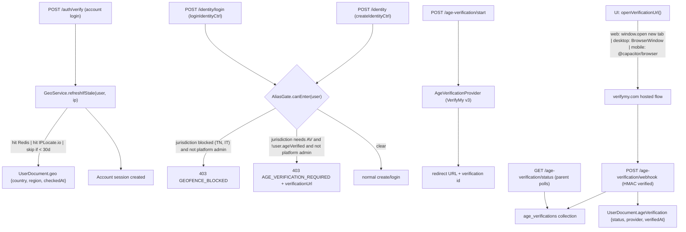

# Age Verification (VerifyMy v3) and IP Geofencing

## 1. Architecture at a glance



## 2. Configuration and secrets

Extend [apps/api/src/config/index.ts](apps/api/src/config/index.ts) (lines 42-113, 206-234) with two new sub-objects, all using the existing `optionalEnv` / `requireEnv` helpers:

- `config.verifymy = { apiKey, apiSecret, webhookSecret, environment: 'sandbox'|'production', sandboxBaseUrl, productionBaseUrl }`
- `config.geo = { iplocate: { apiKey, baseUrl }, cacheTtlSeconds, recheckIntervalDays: 30 }`

Note: the *runtime* sandbox/production toggle is driven by a platform setting (see Section 5); env values are bootstrapping defaults. This lets us point a production deploy at the VerifyMy sandbox without redeploying.

## 3. Geolocation: IPLocate.io with Redis caching

New module split into small files (each well under 750 lines):

- `apps/api/src/services/geo/iplocate.client.ts` — bare HTTP client; one function `lookupIp(ip)` returning `{ countryCode, regionCode, regionName, city }` or `null`. No business logic.
- `apps/api/src/services/geo/jurisdiction.ts` — pure helpers: `toJurisdictionCode({countryCode, regionCode})` returning canonical strings like `US-TN`, `IT`, `US`, plus `parseBlockedJurisdictions(setting)` etc. Easy to unit test.
- `apps/api/src/services/geo/geo.service.ts` — public surface used by the rest of the app:
  - `resolveJurisdiction(ip): Promise<JurisdictionResult>` (Redis cache, 24h TTL)
  - `refreshUserGeoIfStale(user, ip): Promise<UserGeo>` (returns existing geo if `checkedAt` < 30 days, else refreshes and persists on user)

Redis keys live in `apps/api/src/db/redis.ts` `RedisKeys` (mirroring `platformAuthAllowlistCache`, see lines 303-410):
- `RedisKeys.geoIpLookup(ip)` — IPLocate response cache
- `RedisKeys.geoUserCheck(userId)` — guard for the once-per-30-days policy

Security notes:
- `getClientIp` in [apps/api/src/routes/auth/controller.ts](apps/api/src/routes/auth/controller.ts) (lines 343-358) trusts `X-Real-IP` / `X-Forwarded-For`. The existing JSDoc warns these can be spoofed. We will add an explicit deployment-time check: `config.security.trustProxyHeaders` must be `true` in production, and we will refuse to enforce geofencing if it is not. (We will also note this in the deployment runbook.)
- The IPLocate API key is server-side only; never exposed to the client.
- We never store the raw IP on the user document long-term; only `{ jurisdiction, checkedAt }` and a hashed IP (for the 30-day staleness check, to avoid re-querying when the user is on the same IP).

## 4. Provider-agnostic age verification

Provider interface in `apps/api/src/services/age-verification/provider.ts`:

```ts
export interface AgeVerificationProvider {
  readonly id: string;
  startVerification(input: { userId: string; jurisdiction: string; redirectUrl: string; locale?: string }): Promise<{ providerVerificationId: string; redirectUrl: string }>;
  getVerificationStatus(providerVerificationId: string): Promise<AgeVerificationStatus>;
  verifyWebhookSignature(rawBody: string, headers: Headers): boolean;
  parseWebhookPayload(rawBody: string): AgeVerificationWebhookEvent;
}
```

Implementations:
- `apps/api/src/services/age-verification/verifymy.provider.ts` — VerifyMy v3 (HMAC-signed REST). Honors the `environment` (sandbox/production) toggle from platform settings, falling back to the env value.
- A registry (`apps/api/src/services/age-verification/providers.ts`) maps provider id -> implementation. The platform setting `age-verification-active-provider` selects the active one.

Orchestration service in `apps/api/src/services/age-verification/age-verification.service.ts` exposes:
- `startVerification(user, jurisdiction)` — picks provider, persists an `age_verifications` doc, returns the redirect URL.
- `getVerificationStatus(verificationId, user)` — checks DB (updated by webhook), falls back to provider polling if older than N seconds.
- `applyWebhookEvent(rawBody, headers)` — verifies HMAC, parses, updates the verification doc, and on `verified=true` flips `user.ageVerification.status`.

Jurisdiction policy in `apps/api/src/services/age-verification/jurisdiction-policy.ts`:
- Default policy table (data only, no logic): `{ jurisdiction -> { required: boolean, minStep: 'email'|'face'|'id+face', notes? } }`. We seed this with the regions VerifyMy currently lists; admins can override per-jurisdiction via platform setting.
- `getPolicy(jurisdiction)` returns the effective policy after applying admin overrides.

New repository: `apps/api/src/repositories/age-verification.repository.ts` for the new `age_verifications` Mongo collection. Document shape:

```ts
{
  _id, userId, providerId, providerVerificationId,
  status: 'pending'|'in_progress'|'verified'|'failed'|'expired',
  jurisdiction, attemptCount, startedAt, completedAt?, lastWebhookAt?,
  // No DOB, no document images, no PII beyond what we minimally need.
}
```

## 5. Platform settings

New keys in [apps/api/src/constants/platform-settings-keys.ts](apps/api/src/constants/platform-settings-keys.ts):

- `AGE_VERIFICATION_ENABLED` (boolean)
- `AGE_VERIFICATION_ACTIVE_PROVIDER` (string, default `'verifymy'`)
- `AGE_VERIFICATION_VERIFYMY_ENV` (string `'sandbox'`|`'production'`)
- `AGE_VERIFICATION_REQUIRED_MODE` (string `'all'`|`'jurisdictions'`) — when `'all'`, every alias action requires verification regardless of jurisdiction
- `AGE_VERIFICATION_REQUIRED_JURISDICTIONS` (stringArray) — additive overrides
- `GEOFENCE_BLOCKED_JURISDICTIONS` (stringArray, seeded with `['US-TN','IT']`)
- `GEOFENCE_LAW_LINKS` (stringArray of `"jurisdiction|url"` pairs) — used by the UI to deep-link to the relevant statute

Mirror the bootstrapping pattern from [apps/api/src/services/platform-settings.service.ts](apps/api/src/services/platform-settings.service.ts) (`ensure*PlatformSetting*Exist`), and add an `ageVerificationSettings.service.ts` cache analogous to `loadAuthAllowlistState` (lines 19-95) so we do not re-read Mongo on every alias action.

Admin endpoints: the existing `PUT /admin/platform-settings/:key` route ([apps/api/src/routes/admin/index.ts](apps/api/src/routes/admin/index.ts) lines 260-352) already supports any key; we just need to register the new keys, no new routes.

## 6. User document additions

Extend [apps/api/src/models/user.ts](apps/api/src/models/user.ts) `UserDocument` (lines 12-48):

```ts
ageVerification?: {
  status: 'unverified'|'pending'|'verified'|'failed';
  providerId?: string;
  providerVerificationId?: string;
  verifiedAt?: Date;
  lastJurisdiction?: string;
};
geo?: {
  jurisdiction?: string;        // e.g. "US-TN"
  countryCode?: string;
  regionCode?: string;
  ipHash?: string;              // SHA-256(ip + accountHashSecret) for staleness check
  checkedAt: Date;
};
```

Migration: none required (optional fields). Add a one-shot script under `apps/api/scripts/` only if we want to backfill — not strictly necessary.

## 7. Account login: run geo refresh, never block

In [apps/api/src/routes/auth/controller.ts](apps/api/src/routes/auth/controller.ts) `verifyOtpHandler` (lines 503-642), after `createAccountSession` succeeds and we have `user`, fire-and-await `geoService.refreshUserGeoIfStale(user, sanitizedIp.value)`. Failures (IPLocate down, rate-limited) must NOT block login: log a warning and continue. If we have no fresh geo, the alias gate degrades safely (see Section 8).

We do not need to extend `AccountSessionData` ([apps/api/src/services/session.service.ts](apps/api/src/services/session.service.ts) lines 37-99) because the gate reads from the user document, not the session.

## 8. Alias gate: identity create + login

New module `apps/api/src/services/age-verification/alias-gate.ts`:

```ts
export type AliasGateResult =
  | { allowed: true }
  | { allowed: false; code: 'GEOFENCE_BLOCKED'; jurisdiction: string; lawUrl?: string }
  | { allowed: false; code: 'AGE_VERIFICATION_REQUIRED'; jurisdiction: string; minStep: 'email'|'face'|'id+face' };

export async function evaluateAliasGate(user, opts: { isPlatformAdminUser: boolean }): Promise<AliasGateResult>;
```

Decision rules:
1. If user has any platform-admin identity attached, `allowed: true` (bypass). For `createIdentityCtrl` we cannot use `isPlatformAdmin(identityId)` because the identity is being created; instead we expose a new helper `isPlatformAdminUser(userId)` that checks whether *any* of the user's existing identities is a platform admin (using the existing `platform-admin-identity-list` setting).
2. If `!ageVerificationEnabled`, allowed.
3. If `user.geo.jurisdiction` is missing AND geo lookup is enabled, treat as a soft fail: allow the action but log; an admin platform setting `AGE_VERIFICATION_FAIL_CLOSED` can flip this to deny. (Default: fail-open to avoid bricking users when IPLocate is down. We will document this trade-off.)
4. If jurisdiction is in `GEOFENCE_BLOCKED_JURISDICTIONS`: `GEOFENCE_BLOCKED`.
5. If jurisdiction policy is `required` AND `user.ageVerification?.status !== 'verified'`: `AGE_VERIFICATION_REQUIRED`.
6. Otherwise allowed.

Wire-in points (both already extract `clientIp` and `userAgent`, so the call is a one-liner):
- [apps/api/src/routes/identity/controller.ts](apps/api/src/routes/identity/controller.ts) `createIdentityCtrl` lines 166-212 — insert between line 187 and the `createIdentity` call at line 188.
- [apps/api/src/routes/identity/controller.ts](apps/api/src/routes/identity/controller.ts) `loginIdentityCtrl` lines 227-307 — insert between `verifySignedToken` and the `loginToIdentity` call.

Error response shape mirrors the existing `error()` helper at [apps/api/src/utils/response.ts](apps/api/src/utils/response.ts) lines 168-188:

```json
{ "success": false, "error": { "code": "AGE_VERIFICATION_REQUIRED", "message": "...", "details": { "jurisdiction": "US-CA", "verificationUrl": "/api/age-verification/start" } } }
```

## 9. Age verification routes

New router `apps/api/src/routes/age-verification/`:

- `POST /api/age-verification/start` — requires account session; calls `ageVerificationService.startVerification(user, jurisdiction)`; returns `{ verificationId, redirectUrl, providerId }`.
- `GET /api/age-verification/status?id=...` — requires account session; returns `{ status, jurisdiction, completedAt? }`. Used by the UI poller.
- `POST /api/age-verification/webhook` — public, but HMAC-verified. Calls `ageVerificationService.applyWebhookEvent(rawBody, headers)`. Rate-limited and protected with constant-time signature comparison. Refuses requests when the webhook secret is unset.
- `GET /api/age-verification/return` — the redirect target VerifyMy sends users to. Renders a tiny self-closing HTML page that posts a `postMessage` to its opener (web) or fires a deep-link callback (desktop/mobile), so the parent UI knows to stop polling immediately.

## 10. UI changes

### 10a. Cross-platform "open verification URL" helper

New `packages/ui/src/services/openVerificationUrl.ts`:

```ts
export async function openVerificationUrl(url: string, platform: Platform): Promise<void>;
```

- `web` -> `window.open(url, '_blank', 'noopener,noreferrer')` (mirrors existing pattern in [packages/ui/src/components/ExternalLinkModal.tsx](packages/ui/src/components/ExternalLinkModal.tsx) line 44).
- `desktop` -> new whitelisted IPC channel `'open-verification-window'` exposed via `window.electron.invoke`; the main process opens a child `BrowserWindow` (sized like a popup) with strict `webPreferences` (`contextIsolation: true`, `nodeIntegration: false`, `sandbox: true`) and listens for navigation back to our return URL to close itself.
- `mobile` -> `@capacitor/browser` `Browser.open({ url })`. We need to add this dependency to `apps/mobile/package.json` (pinned exact version per `.cursor/rules/exact-version-pinning.mdc`).

### 10b. Auth state additions

Extend [packages/shared/src/api/auth-types.ts](packages/shared/src/api/auth-types.ts) `SessionInfo` (lines 49-68) with optional fields needed for UX gating without an extra round-trip:

```ts
ageVerification?: { status: 'unverified'|'pending'|'verified'|'failed' };
geo?: { jurisdiction?: string; isBlocked?: boolean };
aliasGate?: { allowed: boolean; code?: 'GEOFENCE_BLOCKED'|'AGE_VERIFICATION_REQUIRED'; jurisdiction?: string; lawUrl?: string };
```

The API `GET /api/auth/session` endpoint already powers `useAuth.refreshSession` ([packages/ui/src/hooks/useAuth.tsx](packages/ui/src/hooks/useAuth.tsx) lines 93-136); extend its response in `routes/auth` to include the gate evaluation for the current user.

### 10c. Identity modal: new states

In [packages/ui/src/app/IdentityModal.tsx](packages/ui/src/app/IdentityModal.tsx):
- Add new `view` values: `'geofenced'` and `'age_verification_required'`.
- Render the new views when `useAuth().session?.aliasGate?.allowed === false` — gating happens *before* form submission rather than only on error response, so the user never types a passphrase they cannot use.
- Map new server error codes in [packages/ui/src/services/identityCreateFlow.ts](packages/ui/src/services/identityCreateFlow.ts) (lines 41-57) and `resolveLoginFailure` so a server-side denial (race condition) also surfaces correctly.

### 10d. Two new ArkUI-based components

- `packages/ui/src/app/GeofenceBlockedModal.tsx` — clear copy stating the service is unavailable in their region with a link to the relevant law (from `GEOFENCE_LAW_LINKS`). Uses the existing `Dialog` + `Portal` pattern (see `ExternalLinkModal`).
- `packages/ui/src/app/AgeVerificationModal.tsx` — explains why verification is needed, calls `POST /age-verification/start`, opens the URL via `openVerificationUrl`, then polls `GET /age-verification/status` every 3s with backoff. Shows progress states: `awaiting_user`, `provider_processing`, `verified`, `failed`. On `verified`, calls `useAuth().refreshSession()` and closes.

Both are responsive-first per `.cursor/rules/ui-uses-arkui-responsive.mdc`.

### 10e. Hook

`packages/ui/src/hooks/useAgeVerification.tsx`:

```ts
export function useAgeVerification(): {
  status: 'idle'|'starting'|'awaiting_user'|'polling'|'verified'|'failed';
  start(jurisdiction: string): Promise<void>;
  cancel(): void;
};
```

### 10f. Admin UI

New page `packages/ui/src/pages/admin/AgeVerification.tsx`, mirroring [packages/ui/src/pages/admin/AuthAllowlist.tsx](packages/ui/src/pages/admin/AuthAllowlist.tsx) (lines 12-32, 67-102). Add a nav item to [packages/ui/src/pages/admin/AdminLayout.tsx](packages/ui/src/pages/admin/AdminLayout.tsx) (lines 14-30) and a route to [packages/ui/src/app/App.tsx](packages/ui/src/app/App.tsx) `/admin/age-verification`. Edits the new platform settings using the existing `api.admin.putPlatformSetting` helper.

## 11. CSP additions

- [apps/web/src/csp.ts](apps/web/src/csp.ts) (lines 21-48): add VerifyMy domains to `connect-src` (status polling fallback if we ever go direct from the client) and to `form-action` (in case the return page does form posts). Confirm exact origin during implementation; we will not whitelist anything broader than the documented production hosts.
- [apps/desktop/src/csp.ts](apps/desktop/src/csp.ts): same additions.
- [apps/api/src/middleware/security-headers.ts](apps/api/src/middleware/security-headers.ts) (lines 48-66): keep `frame-ancestors 'none'` (we never embed VerifyMy in an iframe; the redirect flow does not require it).
- IPLocate is server-to-server only; no client CSP entry needed.

## 12. Electron and Capacitor platform integration

- [apps/desktop/src/preload.ts](apps/desktop/src/preload.ts): add `'open-verification-window'` to the `allowedChannels` whitelist (lines 23-94).
- New `apps/desktop/src/main-process/verification-window.ts` to create the child `BrowserWindow` (modeled after [apps/desktop/src/webauthn-bridge.ts](apps/desktop/src/webauthn-bridge.ts) lines 136-179, but visible and user-sized).
- Add `@capacitor/browser` to `apps/mobile/package.json` with an exact pinned version, and a thin wrapper in `apps/mobile/src/` if any platform-specific listeners are needed.

## 13. Internationalisation

New module `packages/ui/src/i18n/locales/en/compliance.ts` (mirroring the `account` pattern at [packages/ui/src/i18n/locales/en/account.ts](packages/ui/src/i18n/locales/en/account.ts)) with namespaces `compliance.geofence.*`, `compliance.ageVerification.*`, `compliance.admin.*`. Merge into [packages/ui/src/i18n/locales/en/index.ts](packages/ui/src/i18n/locales/en/index.ts).

## 14. Testing strategy

Bun test (`bun:test` + `mock.module`) per [apps/api/src/services/platform-settings.service.test.ts](apps/api/src/services/platform-settings.service.test.ts) style. Coverage targets:

- `services/geo/jurisdiction.test.ts` — pure logic.
- `services/geo/geo.service.test.ts` — Redis cache hit/miss, IPLocate failure fallback, 30-day staleness.
- `services/age-verification/jurisdiction-policy.test.ts` — policy resolution with admin overrides.
- `services/age-verification/alias-gate.test.ts` — every branch (admin bypass, geofence, av required, fail-open, fail-closed).
- `services/age-verification/verifymy.provider.test.ts` — request shape, HMAC signing, webhook signature verification (positive and negative), payload parsing.
- `services/age-verification/age-verification.service.test.ts` — orchestration, webhook idempotency.
- Route tests for the three new endpoints + identity controller gate behavior, mirroring [apps/api/src/routes/admin/index.test.ts](apps/api/src/routes/admin/index.test.ts).
- UI: a `IdentityModal.test.tsx` adding cases for the new views; `useAgeVerification.test.tsx` for the polling state machine.

## 15. Rollout

- Ship dark by default: `AGE_VERIFICATION_ENABLED=false`. Once admin UI is validated against the VerifyMy sandbox, flip to `true` in production.
- New env vars (documented in `.env.example` and `apps/api/README.md`): `VERIFYMY_API_KEY`, `VERIFYMY_API_SECRET`, `VERIFYMY_WEBHOOK_SECRET`, `VERIFYMY_ENVIRONMENT`, `IPLOCATE_API_KEY`.
- Add an ops runbook entry: how to rotate the VerifyMy webhook secret, how to switch between sandbox and production via the admin UI without a redeploy, and how to confirm the reverse proxy strips inbound `X-Forwarded-For` from untrusted hops.

## 16. Verification before done

Per `.cursor/rules/verify-before-done.mdc`:
- `pnpm run lint` and `pnpm run typecheck` (root and affected packages).
- `pnpm audit` and `npm audit signatures` because we are adding `@capacitor/browser`.
- `pnpm run test` for `apps/api` and `packages/ui`.
- `pnpm run build` to confirm no module-resolution regressions across `apps/web`, `apps/desktop`, `apps/mobile`.