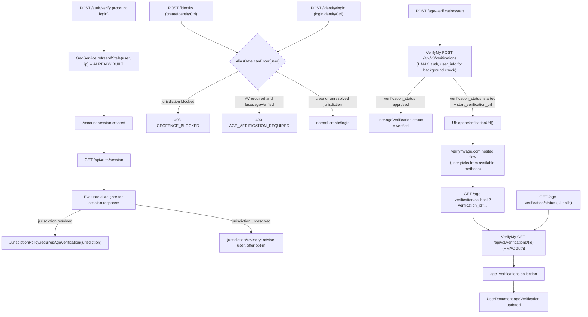

# Age Verification (VerifyMy) and Jurisdiction Geofencing

## 1. Architecture at a glance



## 2. What is already built (not in scope)

The following are implemented and working. This plan extends them but does not rebuild them:

- **IPLocate client** (`services/geo/iplocate.client.ts`): `lookupIp(ip)` -> `IpLocateResult | null`
- **Jurisdiction helpers** (`services/geo/jurisdiction.ts`): `toJurisdictionCode`, `fromIpLocateResult`, `parseJurisdictionList`
- **Geo service** (`services/geo/geo.service.ts`): `resolveJurisdiction(ip)` (Redis-cached), `refreshUserGeoIfStale(user, ip)` (30-day / IP-change staleness)
- **Geo settings** (`services/geo/geo-settings.ts`): `isGeoLookupEnabled()` platform-setting toggle
- **User.geo** on `UserDocument`: jurisdiction, countryCode, regionCode, ipHash, checkedAt
- **Auth integration**: `refreshUserGeoIfStale` fires after OTP and MFA login (non-blocking)
- **Config**: `config.geo` with IPLocate key, cache TTLs, trust-proxy toggle
- **Jurisdiction requirements seed data** (`scripts/data/jurisdiction-requirements.seed.ts`): regulatory matrix with `requirements[]` (includes `age_verification` slug) and `compatibleMethods[]` per jurisdiction
- **Session API**: `GET /api/auth/session` already returns `geo` from `user.geo`

## 3. Configuration and secrets

Extend `apps/api/src/config/index.ts` with one new sub-object using existing `optionalEnv` / `requireEnv` helpers:

```ts
verifymy: {
  apiKey: optionalEnv('VERIFYMY_API_KEY', ''),
  apiSecret: optionalEnv('VERIFYMY_API_SECRET', ''),
  environment: optionalEnv('VERIFYMY_ENVIRONMENT', 'sandbox') as 'sandbox' | 'production',
  sandboxBaseUrl: optionalEnv('VERIFYMY_SANDBOX_BASE_URL', 'https://sandbox.verifymyage.com'),
  productionBaseUrl: optionalEnv('VERIFYMY_PRODUCTION_BASE_URL', 'https://oauth.verifymyage.com'),
},
```

The platform setting `AGE_VERIFICATION_VERIFYMY_ENV` overrides `config.verifymy.environment` at runtime so operators can switch between sandbox and production via the admin UI without a redeploy.

Geo config (`config.geo`) already exists and requires no changes.

## 4. Provider-agnostic age verification

### 4a. Provider interface

`apps/api/src/services/age-verification/provider.ts`:

```ts
export type VerificationStatus = 'started' | 'pending' | 'approved' | 'failed' | 'expired';

export interface StartVerificationResult {
  verificationId: string;
  status: VerificationStatus;
  /** Present when the user must complete interactive verification. */
  redirectUrl?: string;
}

export interface VerificationStatusResult {
  verificationId: string;
  status: VerificationStatus;
  approvalMethod?: string;
  threshold?: number;
  createdAt?: string;
  expiresAt?: string;
  /** Per-method attempt tracking (provider-specific detail). */
  methodAttempts?: Record<string, { enabled: boolean; remaining: number }>;
}

export interface AgeVerificationProvider {
  readonly id: string;

  /**
   * Start a verification. When user_info (email/phone) is provided,
   * the provider may perform a background check and return an immediate
   * approval. Otherwise (or on background-check failure) a redirect URL
   * is returned for interactive verification.
   */
  startVerification(input: {
    redirectUrl: string;
    country: string;
    externalUserId: string;
    userInfo?: { email?: string; phone?: string };
    method?: string;
    webhookUrl?: string;
    webhookNotificationLevel?: 'minimal' | 'method-exhausted' | 'detailed';
  }): Promise<StartVerificationResult>;

  /** Poll the provider for the current status of a verification. */
  getVerificationStatus(verificationId: string): Promise<VerificationStatusResult>;
}
```

### 4b. VerifyMy v3 implementation

`apps/api/src/services/age-verification/verifymy.provider.ts`:

Implements the provider interface using the [VerifyMy v3 API](https://verifymy.io/developer-documentation/age-verification-estimation/apis/starting-a-verification/):

1. **POST `/api/v3/verifications`** -- HMAC-authenticated (`Authorization: hmac {apiKey}:{HMAC-SHA256(body, apiSecret)}`).
   - Request body: `{ redirect_url, country, external_user_id, user_info?, method?, business_settings_id?, webhook?, webhook_notification_level? }`
   - When `user_info` is provided with the user's encrypted email or phone, VerifyMy attempts a background age check. Two response shapes:
     - **Instant approval** (background check succeeded): `{ verification_id, verification_status: "approved" }` -- no user interaction needed.
     - **Redirect required** (background check failed or unavailable): `{ start_verification_url, verification_id, verification_status: "started" }` -- user must complete interactive verification at the hosted URL.
   - Without `user_info`, always returns a redirect URL.
   - The `method` parameter directs the user to try a specific method first; if other methods are available, the user can still choose alternatives within the hosted flow.

2. **GET `/api/v3/verifications/{verification_id}`** -- HMAC-authenticated (`Authorization: {apiKey}:GENERATED-HMAC`).
   - Returns comprehensive status including: `id`, `user_id`, `status`, `approval_method`, `threshold`, `created_at`, `expires_at`, `background_check`, and the `age_gate` object.
   - The `age_gate` object provides per-method detail (`enabled`, `max_attempts`, `remaining_attempts`) for: `login` (Database), `fae` (AgeEstimation), `email` (Email), `idscan` (IDScan), `idscan_plus_facematch` (IDScanFaceMatch), `mobile` (Mobile), `double_blind` (DoubleBlind), `credit_card` (CreditCard).
   - Status lifecycle: `started` -> `pending` -> `approved` | `failed` | `expired`.
   - Verification URLs remain open for **6 hours** before expiring.

3. **Callback flow** -- after the user completes verification, VerifyMy redirects to `redirect_url?verification_id=...`. Our callback endpoint then calls `GET /api/v3/verifications/{verification_id}` to confirm the final status. Deprecated params (`account`, `code`, `scope`, `state`) in the redirect are ignored.

4. **Webhook notifications** (optional) -- if a `webhook` URL is provided when starting the verification, VerifyMy sends event notifications at the configured granularity (`minimal`, `method-exhausted`, `detailed`). This supplements but does not replace the redirect callback.

The `user_info` encryption uses AES-256-CFB with a key derived from `SHA-256(apiSecret)` and a random 16-byte IV prepended to the ciphertext, base64-encoded. Email must follow RFC 3696 (< 254 chars); phone must be E.164 format. Mobile background checks are currently UK-only per VerifyMy docs.

Security notes:
- HMAC signatures use constant-time comparison on our end.
- The API secret never leaves the server.
- Encrypted PII (email/phone) is ephemeral -- constructed per-request, never persisted.
- Environment (sandbox/production) determines the base URL; each environment requires separate API keys and `business_settings_id` values per VerifyMy docs.

### 4c. Provider registry

`apps/api/src/services/age-verification/providers.ts`: maps provider ID -> implementation. The platform setting `AGE_VERIFICATION_ACTIVE_PROVIDER` selects the active one (default: `'verifymy'`).

## 5. Progressive method escalation

We are billed per verification session. A verification session starts when we call `POST /api/v3/verifications` and the resulting URL remains open for 6 hours. Within that session, the user may attempt any of the methods enabled for their `business_settings_id` / `country` configuration, with per-method attempt limits tracked by VerifyMy's `age_gate` object.

Our strategy:

1. **Always start with the least invasive method** compatible with the user's jurisdiction.
2. The `compatibleMethods` array from `jurisdiction_requirements` defines what's allowed. Method ordering (least to most invasive):
   - `email_age_check` -> VerifyMy `Email` (via `user_info` background check if email is available)
   - `mobile_phone` -> VerifyMy `Mobile` (background check, UK-only)
   - `credit_card` -> VerifyMy `CreditCard`
   - `facial_age_estimation` -> VerifyMy `AgeEstimation`
   - `double_blind` / `double_blind_facial_age_estimation` -> VerifyMy `DoubleBlind`
   - `id_scan_face_match` -> VerifyMy `IDScanFaceMatch`
3. When starting a verification, if email/phone is available and compatible with the jurisdiction, include `user_info` in the POST request. If the background check succeeds, `verification_status: "approved"` is returned immediately -- zero user interaction.
4. If the background check fails or is unavailable, VerifyMy returns a `start_verification_url`. We pass the `method` parameter set to the least invasive compatible redirect method for their jurisdiction, directing the user there first. Within the hosted flow, VerifyMy presents alternative methods if available, so the user can self-escalate.
5. Jurisdictions that do not include `email_age_check` in their `compatibleMethods` skip straight to the first compatible redirect method (e.g., Germany requires KJM-approved methods: facial estimation or ID scan only).
6. We store the `verification_id` from the initial POST. The UI polls our `GET /age-verification/status` endpoint (which in turn calls `GET /api/v3/verifications/{id}`), reading the `age_gate` object to display which methods have been attempted and how many attempts remain.

This logic lives in the orchestration service, not the provider.

## 6. Jurisdiction policy module

`apps/api/src/services/age-verification/jurisdiction-policy.ts`:

This module queries the **existing** `jurisdiction_requirements` collection (already seeded with regulatory data) rather than maintaining a parallel policy table.

```ts
export interface JurisdictionAgePolicy {
  required: boolean;
  compatibleMethods: string[];
  leastInvasiveMethod: string;
  legislation: LegislationRef[];
  notes?: string;
}

/** Returns the age verification policy for a jurisdiction, or null if no requirements exist. */
export async function getAgeVerificationPolicy(jurisdiction: string): Promise<JurisdictionAgePolicy | null>;

/** Returns true if the jurisdiction requires age verification (has 'age_verification' in requirements[]). */
export async function requiresAgeVerification(jurisdiction: string): Promise<boolean>;
```

The function checks whether `requirements[]` includes `age_verification` (or similar slugs like `highly_effective_age_assurance`, `appropriate_age_assurance`, `reliable_age_and_identity_verification`). The `compatibleMethods[]` from the seed data maps directly to VerifyMy method names via the escalation table in Section 5.

Admin overrides via `AGE_VERIFICATION_REQUIRED_JURISDICTIONS` (additive) and `AGE_VERIFICATION_REQUIRED_MODE` (`'all'` | `'jurisdictions'`) are applied on top.

## 7. Platform settings

New keys in `apps/api/src/constants/platform-settings-keys.ts`:

- `AGE_VERIFICATION_ENABLED` (boolean) -- master toggle, default `false` (ship dark)
- `AGE_VERIFICATION_ACTIVE_PROVIDER` (string, default `'verifymy'`)
- `AGE_VERIFICATION_VERIFYMY_ENV` (string `'sandbox'` | `'production'`)
- `AGE_VERIFICATION_REQUIRED_MODE` (string `'jurisdictions'` | `'all'`) -- when `'all'`, every account requires verification regardless of jurisdiction
- `AGE_VERIFICATION_REQUIRED_JURISDICTIONS` (stringArray) -- additive overrides beyond what the seed data provides
- `GEOFENCE_BLOCKED_JURISDICTIONS` (stringArray, seeded `[]`) -- jurisdictions where the service is entirely blocked
- `GEOFENCE_LAW_LINKS` (stringArray of `"jurisdiction|url"` pairs) -- UI links to relevant statutes

Bootstrap pattern mirrors the existing `ensure*PlatformSetting*Exist` approach in `platform-settings.service.ts`. A settings cache analogous to `loadAuthAllowlistState` avoids re-reading Mongo on every alias action.

Admin endpoints: the existing `PUT /admin/platform-settings/:key` route already supports any key; we only register the new keys, no new routes needed.

## 8. User document additions

Extend `apps/api/src/models/user.ts` `UserDocument`:

```ts
ageVerification?: {
  status: 'unverified' | 'pending' | 'verified' | 'failed' | 'expired';
  providerId?: string;
  providerVerificationId?: string;
  verifiedAt?: Date;
  /** When the most recent verification failed (drives 30-day cooldown). */
  failedAt?: Date;
  /** The jurisdiction under which verification was performed */
  lastJurisdiction?: string;
  /** True if the user voluntarily opted in to verification (unresolved jurisdiction) */
  optedIn?: boolean;
  /** How many times the verification has expired (max 3 before 30-day cooldown). */
  expirationCount: number;
  /** When the most recent expiration occurred (drives 24h and 30-day cooldowns). */
  lastExpiredAt?: Date;
};
```

`UserGeo` already exists and requires no changes. Migration: none required (optional fields, `expirationCount` defaults to 0).

## 9. Alias gate: account-level enforcement

`apps/api/src/services/age-verification/alias-gate.ts`:

```ts
export type AliasGateResult =
  | { allowed: true }
  | { allowed: false; code: 'GEOFENCE_BLOCKED'; jurisdiction: string; lawUrl?: string }
  | { allowed: false; code: 'AGE_VERIFICATION_REQUIRED'; jurisdiction: string; leastInvasiveMethod: string }
  | { allowed: false; code: 'AGE_VERIFICATION_FAILED'; jurisdiction: string; retryAfter: Date }
  | { allowed: false; code: 'AGE_VERIFICATION_COOLDOWN'; jurisdiction: string; retryAfter: Date };

export async function evaluateAliasGate(user: UserDocument): Promise<AliasGateResult>;
```

Note: there is no admin bypass. The account-identity separation is by design -- we cannot know at the account level whether any of the account's aliases are platform admins.

Decision rules (in order):
1. If `!AGE_VERIFICATION_ENABLED`, `allowed: true`.
2. If `user.geo?.jurisdiction` is absent (jurisdiction unresolved -- either no geo at all, or lookup returned no country, e.g. `127.0.0.1`): **`allowed: true`**. The UI derives the advisory banner from the absence of `session.geo?.jurisdiction` -- no dedicated server field is needed.
3. If jurisdiction is in `GEOFENCE_BLOCKED_JURISDICTIONS`: `GEOFENCE_BLOCKED`.
4. If jurisdiction requires AV (via `requiresAgeVerification(user.geo.jurisdiction)` or `AGE_VERIFICATION_REQUIRED_MODE === 'all'`):
   - If `user.ageVerification?.status === 'verified'`: `allowed: true`.
   - If `user.ageVerification?.status === 'failed'`: `AGE_VERIFICATION_FAILED` with `retryAfter` = `failedAt + 30 days`.
   - If `user.ageVerification?.status === 'expired'`:
     - If `expirationCount < 3`: `AGE_VERIFICATION_COOLDOWN` with `retryAfter` = `lastExpiredAt + 24 hours`.
     - If `expirationCount >= 3`: `AGE_VERIFICATION_COOLDOWN` with `retryAfter` = `lastExpiredAt + 30 days`.
   - Otherwise (unverified or pending): `AGE_VERIFICATION_REQUIRED`.
5. Otherwise `allowed: true`.

### Retry policy

| Status | Cooldown | Notes |
|--------|----------|-------|
| `failed` | 30 days from `failedAt` | User exhausted all methods across all attempts within the VerifyMy session. |
| `expired` (1st-3rd) | 24 hours from `lastExpiredAt` | User did not complete within the 6-hour VerifyMy window. Up to 3 expirations. |
| `expired` (4th+) | 30 days from `lastExpiredAt` | Three expirations exhausted; treated like a failure for cooldown purposes. |

When the cooldown elapses, the user's status resets to `unverified` (either lazily on next gate evaluation or via a scheduled job) so they can attempt verification again.

### Wire-in points

- `createIdentityCtrl` (identity controller) -- insert before `createIdentity` call.
- `loginIdentityCtrl` (identity controller) -- insert before `loginToIdentity` call.

Both check `user.ageVerification.status` on the `UserDocument` when the jurisdiction requires it and return the appropriate error.

### Error responses

Error response shape uses the existing `error()` helper. Distinct messages per state:

**Verification required (unverified/pending):**
```json
{
  "success": false,
  "error": {
    "code": "AGE_VERIFICATION_REQUIRED",
    "message": "Age verification is required in your jurisdiction before creating or accessing aliases.",
    "details": { "jurisdiction": "US-CA", "verificationUrl": "/api/age-verification/start" }
  }
}
```

**Verification failed:**
```json
{
  "success": false,
  "error": {
    "code": "AGE_VERIFICATION_FAILED",
    "message": "Sorry, age verification failed and due to your local legislation we're unable to grant access. You may retry after the cooldown period.",
    "details": { "jurisdiction": "US-CA", "retryAfter": "2026-05-28T12:00:00Z" }
  }
}
```

**On cooldown (expired or exhausted expirations):**
```json
{
  "success": false,
  "error": {
    "code": "AGE_VERIFICATION_COOLDOWN",
    "message": "Your verification session expired. You may retry after the cooldown period.",
    "details": { "jurisdiction": "US-CA", "retryAfter": "2026-04-29T12:00:00Z" }
  }
}
```

## 10. Unresolved jurisdiction handling

A jurisdiction is considered "unresolved" when `user.geo?.jurisdiction` is absent -- either because `user.geo` itself is missing (lookup never ran or was disabled), or because the lookup ran but could not resolve a jurisdiction (e.g. `127.0.0.1`, private-range IPs, or IPLocate returning no country).

- **No blocking.** The alias gate returns `allowed: true`. The user may create and log in to aliases normally.
- **No dedicated server field.** The UI checks `session.geo?.jurisdiction` -- when it is absent (and `AGE_VERIFICATION_ENABLED` is true), the UI renders a non-blocking, dismissible advisory banner advising the user they are responsible for adhering to local law and offering an opt-in link.
- `POST /api/age-verification/opt-in` allows the user to voluntarily start verification. This sets `user.ageVerification.optedIn = true` and proceeds through the normal verification flow. The user may specify their country via request body `{ country: "US" }` so the correct jurisdiction policy and methods apply.

## 11. Age verification routes

New router `apps/api/src/routes/age-verification/`:

- **`POST /api/age-verification/start`** -- requires account session. Calls `ageVerificationService.startVerification(user)`. Passes `user_info` (encrypted email/phone) when available and compatible with the jurisdiction. Returns:
  - `{ verificationId, status: 'approved' }` if the background check succeeds immediately, or
  - `{ verificationId, redirectUrl, status: 'started' }` for the interactive redirect flow.

- **`GET /api/age-verification/status?id=...`** -- requires account session. Calls `GET /api/v3/verifications/{id}` on VerifyMy (HMAC-authenticated) and returns the status, including the `age_gate` per-method attempt breakdown. Also updates the local `age_verifications` doc if the status has changed. Used by the UI poller.

- **`GET /api/age-verification/callback`** -- the redirect target VerifyMy sends users to after the hosted flow. Receives `?verification_id=...` (ignoring deprecated params `code`, `account`, `scope`, `state`). Calls `GET /api/v3/verifications/{verification_id}` to confirm the final status. Updates `age_verifications` doc and `user.ageVerification`. Returns a small self-closing HTML page that posts a `postMessage` to its opener (web) or fires a deep-link callback (desktop/mobile) so the parent UI stops polling.

- **`POST /api/age-verification/opt-in`** -- requires account session. For users with unresolved jurisdictions. Sets `optedIn: true` on the user and delegates to the same start-verification flow. The user may specify their country via request body `{ country: "US" }` so the correct jurisdiction policy and methods apply.

- **`POST /api/age-verification/webhook`** (optional) -- if configured, receives [webhook notifications](https://verifymy.io/developer-documentation/age-verification-estimation/apis/starting-a-verification/) from VerifyMy at the granularity specified when starting the verification (`minimal`, `method-exhausted`, or `detailed`). Updates `age_verifications` and `user.ageVerification` proactively, reducing reliance on polling. This endpoint is public but verifies the request origin (HMAC or IP allowlist per VerifyMy's webhook docs). Rate-limited.

Rate limiting: the start endpoint is rate-limited per account (e.g. 3 attempts per hour) to prevent billing abuse.

## 12. Age verification repository

`apps/api/src/repositories/age-verification.repository.ts` for the `age_verifications` Mongo collection:

```ts
{
  _id, userId, providerId, providerVerificationId,
  status: 'started' | 'pending' | 'approved' | 'failed' | 'expired',
  jurisdiction,
  requestedMethod?: string,   // the method we requested via the `method` param
  approvalMethod?: string,    // the method that ultimately approved (from v3 response)
  backgroundCheck?: string,   // 'email' | 'mobile' | 'full' | null
  startedAt: Date,
  expiresAt?: Date,           // from VerifyMy (6-hour window)
  completedAt?: Date,
  optedIn: boolean,
  // No DOB, no document images, no PII beyond what we minimally need.
}
```

Collection registered in `apps/api/src/db/mongo.ts` with indexes on `userId` and `providerVerificationId`.

## 13. Session payload additions

Extend `GET /api/auth/session` response and the shared `SessionInfo` type in `packages/shared/src/api/auth-types.ts`:

```ts
ageVerification?: {
  status: 'unverified' | 'pending' | 'verified' | 'failed' | 'expired';
  verifiedAt?: string;
  retryAfter?: string;       // ISO 8601 timestamp; present when on cooldown
  expirationCount?: number;  // so the UI can show "attempt 2 of 3"
};
aliasGate?: {
  allowed: boolean;
  code?: 'GEOFENCE_BLOCKED' | 'AGE_VERIFICATION_REQUIRED' | 'AGE_VERIFICATION_FAILED' | 'AGE_VERIFICATION_COOLDOWN';
  jurisdiction?: string;
  lawUrl?: string;
  leastInvasiveMethod?: string;
  retryAfter?: string;
};
```

The `geo` field already exists. When `geo?.jurisdiction` is absent (geo missing entirely, or lookup returned no country) and `AGE_VERIFICATION_ENABLED` is true, the UI derives the jurisdiction advisory locally -- no dedicated server field is needed. The alias gate is evaluated eagerly in the session response so the UI can gate proactively without a round-trip.

## 14. UI changes

### 14a. Cross-platform "open verification URL" helper

New `packages/ui/src/services/openVerificationUrl.ts`:

```ts
export async function openVerificationUrl(url: string, platform: Platform): Promise<void>;
```

- `web` -> `window.open(url, '_blank', 'noopener,noreferrer')` (mirrors existing `ExternalLinkModal` pattern).
- `desktop` -> new whitelisted IPC channel `'open-verification-window'`; main process opens a child `BrowserWindow` with strict `webPreferences` (`contextIsolation: true`, `nodeIntegration: false`, `sandbox: true`).
- `mobile` -> `@capacitor/browser` `Browser.open({ url })`. Add `@capacitor/browser` to `apps/mobile/package.json` (pinned exact version).

### 14b. Auth state additions

Extend `SessionInfo` in shared types (see Section 13). The `useAuth` hook already exposes the full session; no hook changes needed beyond type widening.

### 14c. Identity modal: new states

In `packages/ui/src/app/IdentityModal.tsx`:
- Add new `view` values: `'geofenced'`, `'age_verification_required'`, `'age_verification_failed'`, `'age_verification_cooldown'`.
- Render the appropriate view when `session.aliasGate?.allowed === false` -- gating happens *before* form submission. The `'failed'` and `'cooldown'` views show the `retryAfter` timestamp.
- When `session.geo?.jurisdiction` is absent and `AGE_VERIFICATION_ENABLED` is true, render a non-blocking, dismissible advisory banner within the modal advising the user of their responsibility under local law, with an opt-in link. This is derived client-side from the absence of a resolved jurisdiction -- no dedicated server field.
- Map new server error codes (`AGE_VERIFICATION_REQUIRED`, `AGE_VERIFICATION_FAILED`, `AGE_VERIFICATION_COOLDOWN`, `GEOFENCE_BLOCKED`) in `identityCreateFlow.ts` and `resolveLoginFailure` for server-side denial (race condition).

### 14d. New ArkUI-based components

- **`GeofenceBlockedModal`** -- explains the service is unavailable in their region with a link to the relevant law. Uses the existing `Dialog` + `Portal` pattern.
- **`AgeVerificationModal`** -- explains why verification is needed, calls `POST /age-verification/start`. If the response is `status: 'approved'` (background check succeeded), immediately shows success and calls `refreshSession()`. Otherwise, opens the `redirectUrl` via `openVerificationUrl`, then polls `GET /age-verification/status` every 3s with exponential backoff. Shows progress states: `starting`, `awaiting_user`, `pending` (user has begun but not finished), `approved`, `failed`, `expired`. Displays the `age_gate` breakdown so the user can see which methods they've tried and how many attempts remain. On `approved`, calls `refreshSession()` and closes. On `failed`, shows a clear message: "Sorry, age verification failed and due to your local legislation we're unable to grant access" with the `retryAfter` date. On `expired`, shows the next-retry countdown and how many expiration attempts remain (out of 3).

The jurisdiction advisory (for unresolved geo) is a lightweight inline banner in the identity modal derived from `!session.geo?.jurisdiction`, not a separate modal.

All responsive-first per project rules.

### 14e. Hook

`packages/ui/src/hooks/useAgeVerification.tsx`:

```ts
export function useAgeVerification(): {
  status: 'idle' | 'starting' | 'awaiting_user' | 'polling' | 'approved' | 'failed' | 'expired';
  verificationId?: string;
  ageGate?: Record<string, { enabled: boolean; remaining: number }>;
  start(): Promise<void>;
  optIn(country?: string): Promise<void>;
  cancel(): void;
};
```

### 14f. Admin UI

New page `packages/ui/src/pages/admin/AgeVerification.tsx`, mirroring `AuthAllowlist`. Edits: AV enabled toggle, provider selection, environment toggle, required mode, jurisdiction overrides, geofence list, law links. Add nav item and route entry.

## 15. CSP additions

- `apps/web/src/csp.ts`: add `sandbox.verifymyage.com`, `oauth.verifymyage.com`, and `verify.verifymyage.com` to `connect-src` and `form-action`. The sandbox and production base URLs differ; the hosted verification flow may use `verify.verifymyage.com` as its domain.
- `apps/desktop/src/csp.ts`: same additions.
- `apps/api/src/middleware/security-headers.ts`: keep `frame-ancestors 'none'` (redirect flow, no iframes).
- IPLocate is server-to-server only; no client CSP entry needed.

## 16. Electron and Capacitor platform integration

- `apps/desktop/src/preload.ts`: add `'open-verification-window'` to the `allowedChannels` whitelist.
- New `apps/desktop/src/main-process/verification-window.ts` to create a child `BrowserWindow` for the VerifyMy hosted flow.
- Add `@capacitor/browser` to `apps/mobile/package.json` with an exact pinned version.

## 17. Internationalisation

New module `packages/ui/src/i18n/locales/en/compliance.ts` with namespaces:
- `compliance.geofence.*` -- blocked region messaging
- `compliance.ageVerification.*` -- verification flow copy
- `compliance.advisory.*` -- unresolved jurisdiction advisory
- `compliance.admin.*` -- admin page labels

Merge into `packages/ui/src/i18n/locales/en/index.ts`.

## 18. Testing strategy

Bun test (`bun:test` + `mock.module`) per existing patterns. Coverage targets:

- `services/age-verification/jurisdiction-policy.test.ts` -- policy resolution from seed data, admin overrides, requirement slug matching.
- `services/age-verification/alias-gate.test.ts` -- every branch (geofence, AV required, AV failed with 30-day cooldown, AV expired with 24h cooldown, 3-expiration exhaustion with 30-day cooldown, cooldown elapsed resets to unverified, unresolved jurisdiction pass-through, opt-in, feature-disabled pass-through).
- `services/age-verification/verifymy.provider.test.ts` -- HMAC signing, POST /api/v3/verifications request shape, user_info encryption (AES-256-CFB), GET status parsing, age_gate object handling, instant-approval vs redirect branching, error handling.
- `services/age-verification/age-verification.service.test.ts` -- progressive escalation, background-check-first logic, method ordering per jurisdiction, 6-hour session window handling, status polling and update flow.
- Route tests for the new endpoints + identity controller gate behaviour.
- UI: `IdentityModal.test.tsx` adding cases for new views (geofenced, AV required, AV failed, AV cooldown, jurisdiction advisory from missing geo); `useAgeVerification.test.tsx` for the polling state machine, retry-after display, and expiration count tracking.

## 19. Rollout

- Ship dark by default: `AGE_VERIFICATION_ENABLED=false`. Once admin UI is validated against the VerifyMy sandbox, flip to `true` in production.
- New env vars (documented in `.env.example` and `apps/api/README.md`): `VERIFYMY_API_KEY`, `VERIFYMY_API_SECRET`, `VERIFYMY_ENVIRONMENT`.
- Geo env vars already exist (`IPLOCATE_API_KEY`, `GEO_LOOKUP_ENABLED`, `TRUST_PROXY_HEADERS`, etc.).
- Add an ops runbook entry: how to rotate the VerifyMy API secret, how to switch between sandbox and production via the admin UI, and how to confirm the reverse proxy strips inbound `X-Forwarded-For` from untrusted hops.

## 20. Verification before done

Per project rules:
- `pnpm run lint` and `pnpm run typecheck` (root and affected packages).
- `pnpm audit` and `npm audit signatures` because we are adding `@capacitor/browser`.
- `pnpm run test` for `apps/api` and `packages/ui`.
- `pnpm run build` to confirm no module-resolution regressions.
