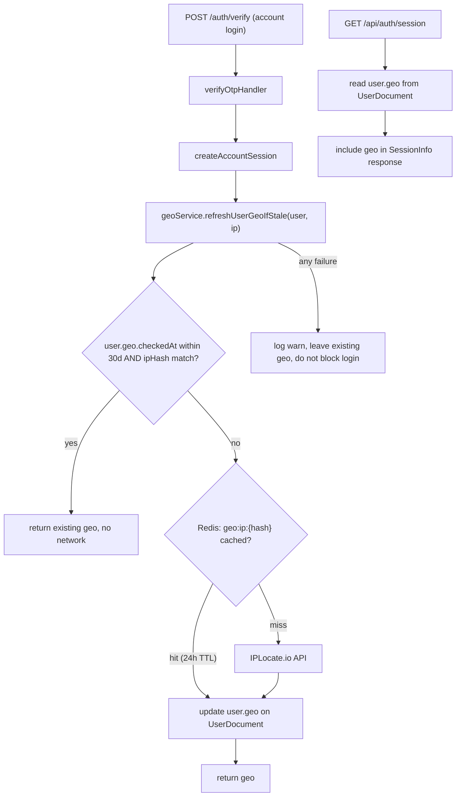

# IP Geolocation Service (IPLocate.io + Redis)

This is a focused infrastructure plan. It adds the ability to know "which jurisdiction is this user in" without yet doing anything with that information beyond exposing it. The downstream consumer (alias gating, age-verification routing, geofencing) lives in the Age Verification plan.

## 1. Architecture



## 2. Configuration and secrets

Extend [apps/api/src/config/index.ts](apps/api/src/config/index.ts) (lines 42-113, 206-234) with one new sub-object using the existing `optionalEnv` / `requireEnv` helpers:

```ts
config.geo = {
  enabled: optionalEnvBool('GEO_LOOKUP_ENABLED', false), // default off; admins flip via setting
  iplocate: {
    apiKey: optionalEnv('IPLOCATE_API_KEY', ''),
    baseUrl: optionalEnv('IPLOCATE_BASE_URL', 'https://www.iplocate.io/api/lookup'),
    timeoutMs: optionalEnvInt('IPLOCATE_TIMEOUT_MS', 2500),
  },
  cacheTtlSeconds: optionalEnvInt('GEO_CACHE_TTL_SECONDS', 86_400),    // 24h IP cache
  recheckIntervalDays: optionalEnvInt('GEO_RECHECK_INTERVAL_DAYS', 30),
  trustProxyHeaders: optionalEnvBool('TRUST_PROXY_HEADERS', false),
};
```

Notes:
- `IPLOCATE_API_KEY` is server-side only and never reaches the client.
- `trustProxyHeaders` is the explicit deployment toggle; if `false` in production we will refuse to call IPLocate (see Security in Section 6) and return `null` from the resolver. The runbook will require this be set to `true` only when the reverse proxy guarantees clean `X-Forwarded-For` / `X-Real-IP`.

## 3. Module layout (every file well under 750 lines)

All new files under `apps/api/src/services/geo/` plus a small repository helper:

- `apps/api/src/services/geo/iplocate.client.ts` — bare HTTP client. Single function:
  ```ts
  export async function lookupIp(ip: string): Promise<IpLocateResult | null>;
  // IpLocateResult = { countryCode: string; regionCode?: string; regionName?: string; city?: string }
  ```
  Uses `fetch` with `AbortSignal.timeout(config.geo.iplocate.timeoutMs)`. Strips IPLocate fields we do not need to keep our surface area (and storage) minimal. Returns `null` on any non-200 / network error / parse failure (caller decides what to do).

- `apps/api/src/services/geo/jurisdiction.ts` — pure helpers, fully unit-testable, no I/O:
  ```ts
  export function toJurisdictionCode(input: { countryCode: string; regionCode?: string }): string;
  // 'US' + 'TN' -> 'US-TN'; 'IT' -> 'IT'; 'GB' + 'ENG' -> 'GB' (we only treat US and Canada as state-aware for now).
  export function isStateAwareCountry(countryCode: string): boolean;
  export function parseJurisdictionList(setting: string[]): Set<string>; // shared with the AV plan later
  ```

- `apps/api/src/services/geo/geo.service.ts` — public surface used by callers:
  ```ts
  export async function resolveJurisdiction(ip: string): Promise<{ jurisdiction: string; countryCode: string; regionCode?: string } | null>;
  export async function refreshUserGeoIfStale(user: UserDocument, ip: string): Promise<UserGeo | null>;
  ```
  - `resolveJurisdiction` does the Redis -> IPLocate -> normalize chain. 24h TTL on the Redis cache key. Never throws; returns `null` on failure.
  - `refreshUserGeoIfStale` short-circuits if `user.geo.checkedAt` is within `recheckIntervalDays` AND `user.geo.ipHash === sha256(ip + accountHashSecret)`. Otherwise calls `resolveJurisdiction` and persists the result via the user repository.

- `apps/api/src/repositories/user.repository.ts` — add a single new method `updateGeo(userId, geo)` (existing repository pattern; just one targeted `$set`).

## 4. Redis keys and helpers

Extend `RedisKeys` in [apps/api/src/db/redis.ts](apps/api/src/db/redis.ts) (existing helpers around lines 303-410), mirroring the `platformAuthAllowlistCache` style:

```ts
RedisKeys.geoIpLookup(ipHash: string): string;        // value: cached IpLocateResult, EX = config.geo.cacheTtlSeconds
RedisKeys.geoNegativeLookup(ipHash: string): string;  // shorter EX (e.g. 5 min) to avoid hammering IPLocate when it returns nothing for an IP
```

We key by `ipHash` (SHA-256 of `ip + config.security.accountHashSecret`) so that:
- the raw IP never appears in Redis (defense in depth, simpler privacy story),
- the same hashing is shared with the user-record `ipHash` staleness check (Section 3).

A negative-cache key prevents repeatedly burning quota on IPs IPLocate cannot resolve.

## 5. UserDocument additions

Extend `UserDocument` in [apps/api/src/models/user.ts](apps/api/src/models/user.ts) (lines 12-48) with one optional sub-object:

```ts
geo?: {
  jurisdiction: string;        // canonical, e.g. 'US-TN', 'IT', 'DE'
  countryCode: string;
  regionCode?: string;
  ipHash: string;              // SHA-256(ip + accountHashSecret); never store raw IP
  checkedAt: Date;
};
```

No migration required (optional field). We deliberately do not add `ageVerification` here — that belongs to the AV plan.

## 6. Wiring into account login

In [apps/api/src/routes/auth/controller.ts](apps/api/src/routes/auth/controller.ts) `verifyOtpHandler` (lines 503-642), after `createAccountSession` succeeds, fire-and-await:

```ts
if (config.geo.enabled) {
  await geoService.refreshUserGeoIfStale(user, sanitizedIp.value).catch((err) => {
    elog.warn('geo refresh failed at login', { error: err, userId: user._id?.toString() });
  });
}
```

Critical security and UX rules:
- **Never block login on a geo failure.** IPLocate downtime, rate limiting, or a missing API key must result in a logged warning and a successful login.
- **Trust proxy enforcement.** Inside `geoService.resolveJurisdiction`, if `config.geo.trustProxyHeaders === false` AND the runtime `NODE_ENV === 'production'`, immediately return `null` and log once at startup. This prevents silently making security decisions on a spoofable IP. The existing JSDoc warning on `getClientIp` ([apps/api/src/routes/auth/controller.ts](apps/api/src/routes/auth/controller.ts) lines 324-358) backs this up.
- **No raw IPs persisted.** Only `ipHash` lands in the user document; only the same hash is used for Redis keys.

We do not need to change `AccountSessionData` ([apps/api/src/services/session.service.ts](apps/api/src/services/session.service.ts) lines 37-99); the geo lives on the user document and is read on demand.

## 7. Exposing geo to the UI

Extend `SessionInfo` in [packages/shared/src/api/auth-types.ts](packages/shared/src/api/auth-types.ts) (lines 49-68):

```ts
geo?: {
  jurisdiction: string;
  countryCode: string;
  regionCode?: string;
  checkedAt: string; // ISO
};
```

The existing `GET /api/auth/session` handler (which `useAuth.refreshSession` calls; see [packages/ui/src/hooks/useAuth.tsx](packages/ui/src/hooks/useAuth.tsx) lines 93-136) reads from the user document and includes `user.geo` (sans `ipHash`) in the response. No new endpoint is needed; the UI consumes `useAuth().session?.geo`.

This plan does not add any geo-driven UI behavior — that is for the Age Verification plan to layer on top.

## 8. Optional: minimal admin readout

Tiny addition to make this useful in isolation and to debug deployments:

- Reuse the existing `PUT /admin/platform-settings/:key` route ([apps/api/src/routes/admin/index.ts](apps/api/src/routes/admin/index.ts) lines 260-352) to expose one new key:
  - `GEO_LOOKUP_ENABLED` (boolean) — flips the runtime toggle without a deploy.
  - Register the key in [apps/api/src/constants/platform-settings-keys.ts](apps/api/src/constants/platform-settings-keys.ts) and have the geo service prefer the platform setting over the env default.
- Add a small `Geo` section to the existing admin dashboard ([packages/ui/src/pages/admin/Dashboard.tsx](packages/ui/src/pages/admin/Dashboard.tsx)) showing only the current account's resolved jurisdiction (read from `useAuth().session.geo`) — useful for ops to verify in production whether geo is wired up. No new admin route required.

## 9. Tests

Bun (`bun:test` + `mock.module`) per [apps/api/src/services/platform-settings.service.test.ts](apps/api/src/services/platform-settings.service.test.ts) style:

- `services/geo/jurisdiction.test.ts` — pure logic: state-aware countries, joining country+region, parsing setting lists.
- `services/geo/iplocate.client.test.ts` — mocked `fetch`; happy path, non-200, network error, AbortSignal timeout, malformed JSON.
- `services/geo/geo.service.test.ts` — Redis hit / miss / negative-cache, 30-day staleness short-circuit, ipHash-mismatch forces refresh, trust-proxy=false in prod returns null, IPLocate failure leaves existing user.geo untouched.
- `routes/auth/controller.test.ts` (or extension thereof) — verifyOtpHandler still succeeds when `geoService.refreshUserGeoIfStale` rejects.

## 10. Rollout and ops

- Default `GEO_LOOKUP_ENABLED=false`. Enable per environment after `IPLOCATE_API_KEY` is set and `TRUST_PROXY_HEADERS=true` has been confirmed in the deployed reverse-proxy config.
- New env vars (added to `.env.example` and `apps/api/README.md`):
  - `IPLOCATE_API_KEY`
  - `IPLOCATE_BASE_URL` (optional)
  - `IPLOCATE_TIMEOUT_MS` (optional)
  - `GEO_LOOKUP_ENABLED` (optional)
  - `GEO_CACHE_TTL_SECONDS` (optional)
  - `GEO_RECHECK_INTERVAL_DAYS` (optional)
  - `TRUST_PROXY_HEADERS` (required to be `true` in production for geo to function)
- Runbook addendum:
  - How to verify the reverse proxy strips inbound spoofed `X-Forwarded-For` from untrusted hops.
  - IPLocate free tier is 1,000 lookups/day; with 24h IP cache + 30-day per-user check this comfortably fits typical traffic. If we approach the limit we can either upgrade or extend the per-user interval via setting.
  - How to disable the feature platform-wide via the admin setting.

## 11. Verification before done

Per `.cursor/rules/verify-before-done.mdc`:
- `pnpm run lint` and `pnpm run typecheck` for the workspace and at minimum `apps/api` and `packages/shared`.
- `pnpm run test` for `apps/api`.
- `pnpm run build` for `apps/api` and `apps/web` (the latter only because of the shared `SessionInfo` extension).
- No new dependencies beyond what `fetch` and `ioredis` already give us, so no `pnpm audit` / `npm audit signatures` strictly required — but I will run them anyway for sanity.