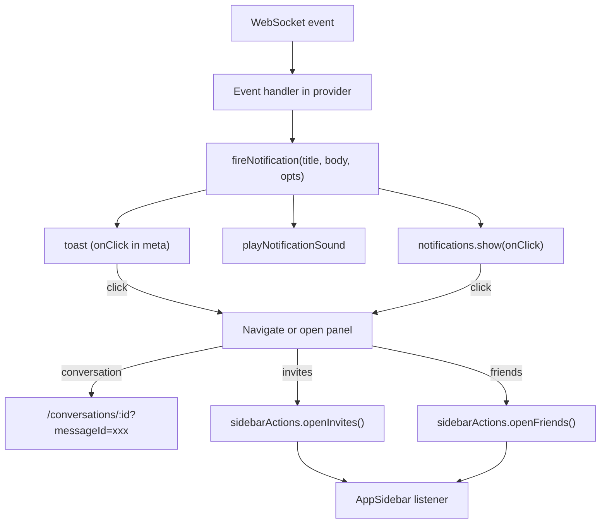

# Notification Click-Through Navigation

## Architecture

The notification system has three layers that all need `onClick` support:

1. **In-app toast** (`Toast.tsx`) -- Ark UI toaster, currently no click handling on the toast body
2. **Native OS notification** (`Notifications.show`) -- already accepts `onClick` in its interface but no callers pass one
3. **`fireNotification`** (in `useConversations.tsx` and `useFriends.tsx`) -- orchestrates all three; needs to thread through an `onClick`

Two navigation targets are special because they're sidebar panel state (not routes):
- **Chat invites panel** -- toggled via `isChatInvitesPanelOpen` local state in `AppSidebar`
- **Friends panel** -- toggled via `isFriendsPanelOpen` local state in `AppSidebar`

Since `ConversationsProvider` and `FriendsProvider` are *ancestors* of `AppSidebar` in the component tree, a simple React context won't work for upward communication. A module-level event emitter solves this cleanly.



## Changes by file

### 1. NEW: `packages/ui/src/utils/sidebarActions.ts`

A tiny module-level event emitter (no React dependency):

```typescript
type SidebarAction = 'openFriends' | 'openInvites';
const listeners = new Set<(action: SidebarAction) => void>();

export const sidebarActions = {
  subscribe(fn: (action: SidebarAction) => void) {
    listeners.add(fn);
    return () => { listeners.delete(fn); };
  },
  openFriends() { listeners.forEach((fn) => fn('openFriends')); },
  openInvites() { listeners.forEach((fn) => fn('openInvites')); },
};
```

### 2. `packages/ui/src/components/Toast.tsx`

- Add `onClick?: () => void` to `ToastOptions`
- Pass `onClick` through `meta` alongside `action`
- On the `.toast-content` div, attach an `onClick` that calls the handler and dismisses the toast
- Add `toast-clickable` CSS class when `onClick` is present (cursor: pointer)
- Update the `info` convenience method signature: `info(title, description?, onClick?)`
- The existing `message` method already has `onView` -- it can stay as-is or be refactored to use `onClick` on the body instead of the action button. Leave it for now since it has no callers.

### 3. `packages/ui/src/styles.scss`

Add styling for `.toast-clickable`:

```scss
.toast-clickable .toast-content {
  cursor: pointer;
}
```

### 4. `packages/ui/src/app/AppSidebar.tsx`

- Import `sidebarActions` from `../utils/sidebarActions`
- In `AppSidebar`, add a `useEffect` that subscribes to `sidebarActions`:
  - `'openFriends'` -> `setFriendsPanelOpen(true); setChatInvitesPanelOpen(false);`
  - `'openInvites'` -> `setChatInvitesPanelOpen(true); setFriendsPanelOpen(false);`
- Cleanup on unmount

### 5. `packages/ui/src/hooks/useConversations.tsx`

- Import `useNavigate` from `react-router-dom`
- Import `sidebarActions` from `../utils/sidebarActions`
- Add `const navigate = useNavigate()` and a `navigateRef` (same ref pattern already used for `fireNotificationRef`, `tRef`, etc.)
- Modify `fireNotification` signature: `(title, body, opts?: { isViewingConvo?: boolean; onClick?: () => void })`
- Inside `fireNotification`:
  - Replace `toast.info(title, body)` with `toast.info(title, body, opts?.onClick)` (after Toast.tsx change)
  - Pass `onClick` to `notifications.show(title, body, { tag: 'conversation-event', onClick: opts?.onClick })`
- Update every call site (all via `fireNotificationRef.current`):

| WS event | onClick action |
|----------|---------------|
| `conversation_created` | `navigate(/conversations/${conversationId})` |
| `conversation_updated` / `removed` | No action (user was removed) |
| `conversation_updated` / `member_added`, `member_left`, `member_removed`, `renamed`, `admin_promoted` | `navigate(/conversations/${conversationId})` |
| `conversation_message` (new msg) | `navigate(/conversations/${conversationId}?messageId=${messageId})` |
| `conversation_message` (reply to me) | `navigate(/conversations/${conversationId}?messageId=${messageId})` |
| `reaction_added` | `navigate(/conversations/${reaction.conversationId}?messageId=${reaction.messageId})` |
| `group_invite_received` | `sidebarActions.openInvites()` |
| `group_invite_accepted` | `navigate(/conversations/${conversationId})` (if available) |
| `group_terminated` | No action (group no longer exists) |
| `notification_created` (reaction) | `navigate(/conversations/${conversationId}?messageId=${messageId})` |

### 6. `packages/ui/src/hooks/useFriends.tsx`

- Import `sidebarActions` from `../utils/sidebarActions`
- Modify `fireNotification` signature: `(title, body, onClick?: () => void)`
- Thread `onClick` through to `toast.info` and `notifications.show`
- Update call sites:

| WS event | onClick action |
|----------|---------------|
| `friend_request_received` | `sidebarActions.openFriends()` |
| `friend_request_accepted` | `sidebarActions.openFriends()` |

### 7. `packages/ui/src/pages/conversations/ConversationView.tsx`

- Import `useSearchParams` from `react-router-dom`
- Read `messageId` from search params: `const [searchParams, setSearchParams] = useSearchParams()`
- Add a `useEffect` that watches `searchParams.get('messageId')`:
  - If present and messages are loaded, call `scrollToMessageId(messageId)`
  - After initiating scroll, clear the param: `setSearchParams((p) => { p.delete('messageId'); return p; }, { replace: true })`
  - If messages aren't loaded yet, the existing `pendingScrollToRef` mechanism handles the deferred scroll automatically

### 8. `packages/ui/src/i18n/locales/en.ts`

No new keys required -- the existing notification copy is sufficient. The click action is implicit (no visible "View" button needed since the whole toast becomes clickable).

## Edge cases

- **Already viewing the conversation**: If the user clicks a toast for a conversation they're already viewing, navigation to the same route is a no-op in React Router, but the `messageId` search param will still trigger `scrollToMessageId`. This is correct behavior.
- **Conversation no longer exists** (e.g. terminated after toast shown): Navigation will land on the conversation view which already handles missing conversations gracefully (shows "not found" / redirects).
- **Multiple toasts**: Each toast captures its own `onClick` closure. Clicking one dismisses only that toast.
- **Toast auto-dismiss**: If the toast auto-dismisses before the user clicks, no harm -- the notification is gone. Native OS notification may still be clickable depending on platform.
