# Passphrase Change + Identity Backup Codes

## Architecture

```mermaid
flowchart TD
    subgraph creation [Identity Creation]
        C1[POST /api/identity] --> C2[Create identity + session]
        C2 --> C3[Generate backup codes]
        C3 --> C4[Return identity + backupCodes]
        C4 --> C5[Client: E2E init]
        C5 --> C6[UI: Show backup codes]
        C6 --> C7["User confirms saved"]
        C7 --> C8[Proceed to login]
    end

    subgraph change [Passphrase Change]
        P1[User enters current + new passphrase] --> P2[Client: Fetch bundle]
        P2 --> P3["Client: Decrypt bundle (old passphrase)"]
        P3 --> P4["Client: Re-encrypt bundle (new passphrase)"]
        P4 --> P5[POST /api/identity/change-passphrase]
        P5 --> P6["Server: Verify current passphrase"]
        P6 --> P7[Server: Derive new ident]
        P7 --> P8["Server: Transaction (update ident + migrate bundle)"]
        P8 --> P9[Server: Generate new backup codes]
        P9 --> P10[Return backupCodes]
        P10 --> P11["Client: Re-wrap local device keys"]
        P11 --> P12[UI: Show new backup codes]
        P12 --> P13["User confirms saved"]
    end
```



---

## A. Identity Backup Codes (Backend)

### A1. New model — `apps/api/src/models/identity-backup-codes.ts`

New file. Follows the existing MFA pattern in [apps/api/src/models/mfa.ts](apps/api/src/models/mfa.ts):

```typescript
export interface IdentityBackupCodesDocument extends BaseDocument {
  identityId: ObjectId;
  hashedCodes: string[];
  totalGenerated: number;
  generatedAt: Date;
}

export interface CreateIdentityBackupCodesInput {
  identityId: ObjectId;
  hashedCodes: string[];
  totalGenerated: number;
}
```

### A2. New repository — `apps/api/src/repositories/identity-backup-codes.repository.ts`

New file. Same CRUD shape as [apps/api/src/repositories/mfa.repository.ts](apps/api/src/repositories/mfa.repository.ts) `BackupCodesRepository`:
- `findByIdentityId(identityId)`
- `create(input)` — deletes existing then inserts (replace semantics)
- `updateCodes(identityId, hashedCodes)` — for consuming a code
- `deleteByIdentityId(identityId)` — cleanup

### A3. New collection + index — `apps/api/src/db/mongo.ts`

Add `IDENTITY_BACKUP_CODES = 'identity_backup_codes'` to `Collections` enum and create a unique index on `identityId` in `ensureIndexes`.

### A4. New service — `apps/api/src/services/identity-backup-codes.service.ts`

New file. Reuses `randomUniformIndex` from [apps/api/src/utils/randomUniformIndex.ts](apps/api/src/utils/randomUniformIndex.ts) and the same alphabet/format as MFA codes (`XXXX-XXXX`, 10 codes, SHA-256 hashing with `identityId + config.security.otpSecret`):

- `generateIdentityBackupCodes(identityId): Promise<string[]>` — returns plaintext codes (stored hashed)
- `verifyIdentityBackupCode(identityId, code): Promise<boolean>` — verify + consume
- `getIdentityBackupCodesCount(identityId): Promise<number>`

### A5. New routes

In [apps/api/src/routes/identity/index.ts](apps/api/src/routes/identity/index.ts) and [apps/api/src/routes/identity/controller.ts](apps/api/src/routes/identity/controller.ts):

- `POST /identity/:id/backup-codes/regenerate` — requires identity session owner; returns new plaintext codes
- `GET /identity/:id/backup-codes/count` — requires identity session owner; returns remaining count

---

## B. Backup Codes on Identity Creation

### B1. Server — modify `createIdentityCtrl`

In [apps/api/src/routes/identity/controller.ts](apps/api/src/routes/identity/controller.ts), after successful `createIdentity`, call `generateIdentityBackupCodes(identity.id)`. Include `backupCodes` in the response payload alongside the identity.

### B2. Client — modify `runCreateIdentityFlow`

In [packages/ui/src/services/identityCreateFlow.ts](packages/ui/src/services/identityCreateFlow.ts), capture `backupCodes` from the creation API response and include them in the `CreateIdentityFlowResult`.

### B3. Client — modify `useIdentity.tsx`

In [packages/ui/src/hooks/useIdentity.tsx](packages/ui/src/hooks/useIdentity.tsx), surface `backupCodes` in the `CreateIdentityResult` type so the modal can display them.

### B4. UI — new `BackupCodesDisplay` component

New file: `packages/ui/src/components/BackupCodesDisplay.tsx`

Shared component used in both creation and passphrase change flows:
- Code grid (styled `<code>` elements, same pattern as [packages/ui/src/components/MfaSetup.tsx](packages/ui/src/components/MfaSetup.tsx))
- **Copy all** button (`navigator.clipboard.writeText`)
- **Download as .txt** button (generates file via `Blob` + `URL.createObjectURL`)
- **Confirmation checkbox**: "I have saved my backup codes in a safe place"
- Warning text about codes not being shown again
- **Continue** / **Done** button, disabled until checkbox is checked
- `onConfirm` callback prop

### B5. UI — new `backup_codes` view in `IdentityModal`

In [packages/ui/src/app/IdentityModal.tsx](packages/ui/src/app/IdentityModal.tsx):
- Add `'backup_codes'` to the `ModalView` union type
- After successful creation, transition to `backup_codes` view (instead of directly to `login`)
- Render `<BackupCodesDisplay>` with `onConfirm` transitioning to `login`
- Update the static `noRecoveryWarning` alert on the create form to reflect that backup codes will be provided

---

## C. Passphrase Change (Backend)

### C1. New repository methods

**[apps/api/src/repositories/identity.repository.ts](apps/api/src/repositories/identity.repository.ts):**
- `changeIdent(identityId, newIdent, newHashVersion)` — updates `ident` and `hashVersion` (used within a transaction)

**[apps/api/src/repositories/key-bundle.repository.ts](apps/api/src/repositories/key-bundle.repository.ts):**
- `migrateBundleId(oldBundleId, newBundleId, encryptedBundle, salt, nonce)` — atomically updates `bundleId` + encrypted contents

### C2. New service function — `changePassphrase`

In [apps/api/src/services/identity.service.ts](apps/api/src/services/identity.service.ts):

```typescript
async function changePassphrase(
  accountHash: string,
  currentPassphrase: string,
  newPassphrase: string,
  newBundle: { encryptedBundle: string; salt: string; nonce: string },
  callerIdentityId: string,
): Promise<ChangePassphraseResult>
```

Logic:
1. Validate both passphrases (format, min length, not equal)
2. Derive current ident from `currentPassphrase + accountHash` → look up identity → verify it matches `callerIdentityId`
3. Derive new ident from `newPassphrase + accountHash`
4. Check no collision (no other identity has the new ident)
5. Compute old and new `bundleId` via `deriveBundleId`
6. **MongoDB transaction** (using existing `withTransaction` from [apps/api/src/db/index.ts](apps/api/src/db/index.ts)):
   - `identityRepo.changeIdent(identityId, newIdent, CURRENT_HASH_VERSION)`
   - `keyBundleRepo.migrateBundleId(oldBundleId, newBundleId, newBundle...)`
7. Generate new backup codes via `generateIdentityBackupCodes(identityId)`
8. Return `{ success: true, backupCodes }`

### C3. New route + controller

In [apps/api/src/routes/identity/controller.ts](apps/api/src/routes/identity/controller.ts):

`POST /identity/change-passphrase` with Zod schema:

```typescript
const ChangePassphraseSchema = z.object({
  signedToken: z.string().min(1),
  currentPassphrase: z.string().min(1),
  newPassphrase: z.string().min(MIN_PASSPHRASE_LENGTH),
  newEncryptedBundle: z.string().min(32).max(8000),
  newBundleSalt: z.string().min(16).max(64),
  newBundleNonce: z.string().min(16).max(64),
});
```

Requires identity session. Verifies `signedToken` for `accountHash`. Calls `changePassphrase` service. Returns `{ backupCodes: string[] }`.

Register in [apps/api/src/routes/identity/index.ts](apps/api/src/routes/identity/index.ts).

### C4. Shared API client

In [packages/shared/src/api/client.ts](packages/shared/src/api/client.ts), add to `IdentityApi`:

- `changePassphrase(params)` — `POST /api/identity/change-passphrase`
- `regenerateBackupCodes(identityId)` — `POST /api/identity/:id/backup-codes/regenerate`
- `getBackupCodesCount(identityId)` — `GET /api/identity/:id/backup-codes/count`

---

## D. Passphrase Change (Frontend)

### D1. Client-side bundle re-encryption

The Change Passphrase UI handler (in `Privacy.tsx`) will:

1. Fetch encrypted bundle via `api.identity.getKeyBundle(identityId)`
2. Decrypt with current passphrase using `decryptKeyBundle` from [packages/ui/src/services/e2eKeyService.ts](packages/ui/src/services/e2eKeyService.ts)
3. Re-encrypt with new passphrase — may need to export an `encryptKeyBundle` helper from the same file (the encrypt path currently lives inside `generateE2EKeys`; extract if not already standalone)
4. Re-derive local wrapping key via `deriveEntropyWrappingKey(newPassphrase, wrappingSalt)` and re-wrap stored device keys in IndexedDB
5. Send everything to `api.identity.changePassphrase(...)`

### D2. UI — Rename Privacy to Privacy & Security

Files to update:
- [packages/ui/src/i18n/locales/en.ts](packages/ui/src/i18n/locales/en.ts) — `identity.menu.privacy` key (sidebar label), `identity.privacy.title`, `identity.privacy.subtitle`
- [packages/ui/src/app/sidebar/identity.tsx](packages/ui/src/app/sidebar/identity.tsx) — the flyout link text comes from the i18n key, so it picks up automatically
- [packages/ui/src/pages/identity/Privacy.tsx](packages/ui/src/pages/identity/Privacy.tsx) — page header uses i18n, picks up automatically

Route path `/identity/privacy` remains unchanged (no breaking URL change).

### D3. UI — Change Passphrase tab in Privacy.tsx

In [packages/ui/src/pages/identity/Privacy.tsx](packages/ui/src/pages/identity/Privacy.tsx), add a third `TabTrigger` value `"change-passphrase"` and corresponding `TabContent`:

**Step 1 — Form:**
- Current passphrase input
- New passphrase input (with strength indicator, reusing patterns from [packages/ui/src/app/IdentityModal.tsx](packages/ui/src/app/IdentityModal.tsx))
- Confirm new passphrase input
- Validation: min 8 chars, must match, not equal to current
- Warning: "This will invalidate your existing backup codes."
- Submit button

**Step 2 — Processing:**
- Spinner while fetching/decrypting/re-encrypting/calling API

**Step 3 — Backup codes:**
- `<BackupCodesDisplay>` with the new codes
- Confirmation checkbox required

**Step 4 — Done:**
- Success message, return to idle state

### D4. UI — Backup code count + regenerate in settings

In the same Privacy & Security page (General tab or a new small section), show:
- Remaining backup code count (fetched from `api.identity.getBackupCodesCount`)
- **Regenerate** button with `ConfirmDialog` (warns that existing codes are invalidated)
- On regenerate: show `<BackupCodesDisplay>` with new codes

---

## E. i18n Keys to Add

All under `identity.privacy` namespace in [packages/ui/src/i18n/locales/en.ts](packages/ui/src/i18n/locales/en.ts):
- Tab label, form labels, validation messages, warnings, success/error messages for passphrase change
- Backup codes section: title, description, confirmation checkbox label, download button, copy button, warning text
- Updated `identity.menu.privacy` value from `'Privacy'` to `'Privacy & Security'`
- Updated page title/subtitle

---

## F. Security Notes

- Backup codes are **hashed server-side** (SHA-256 with identityId + server secret); plaintext returned only once
- Passphrase change is **transactional** — if any step fails, identity and bundle remain unchanged
- Bundle re-encryption is **client-side** — server never sees plaintext bundle or derived keys
- Change passphrase endpoint inherits existing session-based rate limiting
- Current passphrase must be verified before any change occurs
- Backup code confirmation is **UI-enforced** (server generates codes regardless)

## G. Follow-up (Out of Scope)

- **Login via backup code**: Allows a user who has forgotten their passphrase to authenticate with username + backup code, set a new passphrase, and re-initialise E2E. This requires a separate login path and is a distinct feature.
