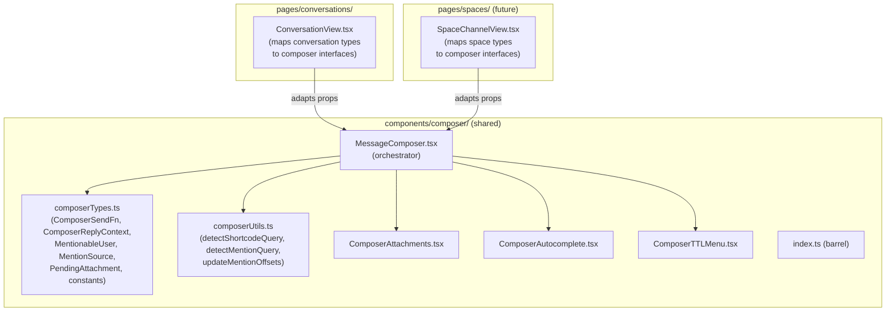

# Refactor ConversationView.tsx

## Current state

[`ConversationView.tsx`](packages/ui/src/pages/conversations/ConversationView.tsx) is a single 3,442-line file containing:

- 10+ utility functions and formatting helpers
- 9 React components (some `memo`'d)
- 1 custom hook (`useExpiryCountdown`)
- Various types, constants, and the exported page component itself

There are **no existing tests** for any of these.

---

## Key design decision: shared, context-agnostic composer

The message composer (~1,018 lines) is being extracted not just for decomposition but for **reuse**. Spaces (future feature -- similar to subreddits/Discord servers with messaging) will need the same composer capabilities. Rather than duplicating or coupling to conversation types, the composer lives under `components/composer/` and defines its own generic interfaces.

### Composer abstraction layer

Current conversation-specific props get replaced by generic equivalents:

- **`conversationId: string`** becomes **`channelId: string`** -- an opaque identifier; conversations pass their ID, Spaces will pass a channel/thread ID.
- **`sendTextMessage(conversationId, plaintext, options)`** becomes **`onSend: ComposerSendFn`** -- `(plaintext: string, options?: ComposerSendOptions) => Promise<unknown>`. The caller (ConversationView, future SpaceChannel) binds the channel ID before passing the callback.
- **`replyingTo: DisplayMessage | null`** becomes **`replyContext: ComposerReplyContext | null`** -- a slim interface `{ messageId: string; authorName: string; snippet: string; onCancel: () => void; onClick?: () => void }`. ConversationView maps `DisplayMessage` into this shape.
- **`participantProfiles` + `memberSettings` + `participants` + `selfId`** become **`mentionSource: MentionSource`** -- `{ mentionableUsers: MentionableUser[]; resolveMentionDisplay: (id: string) => string }` where `MentionableUser` is `{ id: string; displayName: string; username?: string; avatarUrl?: string }`. ConversationView maps its profiles/settings into this shape; Spaces will map its member list.
- **`useFs` / `onToggleFs`** become **optional `forwardSecrecy?: { enabled: boolean; onToggle: () => void }`** -- omitted entirely when the context doesn't support FS.
- **`mentionInsertRef`** stays as-is (already generic).
- **`placeholderTarget`** stays as-is (already generic).

Features the composer supports are **opt-in via presence of props**:
- Attachments: always available (controlled by `MAX_ATTACHMENTS` etc. in `composerTypes.ts`)
- TTL: always available (generic expiry concept)
- FS toggle: present only when `forwardSecrecy` prop is provided
- Mentions: present only when `mentionSource` prop is provided
- Reply: present only when `replyContext` prop is provided

This means Spaces can start with a bare composer (text + attachments + TTL) and progressively add mentions, threading, etc. as they are built out.



---

## Proposed file structure

```
packages/ui/src/
  components/
    composer/                            << NEW: shared, context-agnostic
      index.ts                           (barrel -- exports MessageComposer + types)
      composerTypes.ts                   (~60 lines)
      composerUtils.ts                   (~40 lines)
      composerUtils.test.ts
      MessageComposer.tsx                (~400 lines)
      ComposerAttachments.tsx            (~120 lines)
      ComposerAutocomplete.tsx           (~150 lines)
      ComposerTTLMenu.tsx                (~80 lines)

  pages/conversations/
    index.ts                             (update barrel)
    ConversationView.tsx                 (~350-400 lines, down from 3,442)
    NewConversation.tsx                  (unchanged)
    conversationUtils.ts                 (~120 lines)
    conversationUtils.test.ts
    ConversationToolbar.tsx              (~50 lines)
    ConversationSettingsSidebar.tsx       (~80 lines)
    ConversationMembersSidebar.tsx       (~120 lines)
    ConversationDialogs.tsx              (~80 lines)
    ConversationMessageList.tsx          (~100 lines)
    MemberEditPanel.tsx                  (~70 lines)
    InviteMemberModal.tsx                (~180 lines)
    SystemMessageRow.tsx                 (~80 lines)
    SystemMessageRow.test.tsx
    MessageBubble.tsx                    (~490 lines)
    MessageActionBar.tsx                 (~180 lines)
    ReactionBar.tsx                      (~120 lines)
    MessageMediaAttachment.tsx           (~25 lines)
```

---

## Module breakdown

### 1. `conversationUtils.ts` -- pure helpers and shared types

Extract all stateless utility functions and shared types/constants (lines 53-116, 179-194, 413-437, 663-734):

- `buildReplySnippet`, `replyComposerLabel`, `resolveQuotedAuthorPreview`
- `resolveDisplayName`, `buildReactionTooltip`
- `formatRotationInterval`, `isSameDay`, `formatMessageTime`, `formatAbsoluteTime`, `formatDayLabel`
- Types: `ReplyQuoteAuthorPreview`, `ReplyQuotePayload`, `ChatItem`
- Constants: `MEMBER_COLORS`, `FIRST_ITEM_INDEX`

Tests (`conversationUtils.test.ts`): unit tests for every pure function -- `buildReplySnippet` edge cases, `formatMessageTime` / `formatDayLabel` for today/yesterday/older, `isSameDay`, `resolveDisplayName` with/without nickname, `buildReactionTooltip`.

### 2. `MemberEditPanel.tsx` (lines 118-178)

Self-contained colour/nickname editor. Already a clean function component. Import `MEMBER_COLORS` from `conversationUtils.ts`.

### 3. `MessageActionBar.tsx` (lines 236-412)

The floating action bar with reply, react, favourite, copy, delete, report actions. Already scoped via props. Also export `MESSAGE_ACTION_BAR_POPOVER_POSITIONING`.

### 4. `ReactionBar.tsx` (lines 438-550)

`ReactionChip` (memo) and `ReactionBar` (memo). Imports `buildReactionTooltip` from `conversationUtils.ts`.

### 5. `SystemMessageRow.tsx` (lines 586-662)

System event renderer with `formatRotationInterval` imported from utils. Already isolated.

Tests (`SystemMessageRow.test.tsx`): snapshot via `renderToStaticMarkup` for each `SystemEvent` type, matching the project's existing test pattern.

### 6. `MessageMediaAttachment.tsx` (lines 735-753)

Thin memo wrapper around `MediaMessage` + `useE2EMediaDownload`.

### 7. `MessageBubble.tsx` (lines 755-1237)

The largest single component after decomposition (~490 lines). Includes:
- `ReplyQuoteButton` (small, tightly coupled to bubble rendering)
- `useExpiryCountdown` hook (used only here)
- The bubble itself with linear/standard layout branches

This is on the larger side. If it proves unwieldy during implementation, `useExpiryCountdown` could move to a shared hooks file, but for now it is only consumed here, so colocating keeps things simple.

### 8. `InviteMemberModal.tsx` (lines 1239-1417)

Already a standalone function component. Move as-is with its own imports.

### 9. Shared composer family (`components/composer/`)

The composer spans lines 1418-2436 (~1,018 lines). It moves to `packages/ui/src/components/composer/` with a context-agnostic interface:

- **`composerTypes.ts`** -- Generic interfaces and constants:
  - `ComposerSendOptions` -- `{ useForwardSecrecy?: boolean; replyToMessageId?: string; e2eMediaIds?: string[]; expiresInSeconds?: number }`
  - `ComposerSendFn` -- `(plaintext: string, options?: ComposerSendOptions) => Promise<unknown>`
  - `ComposerReplyContext` -- `{ messageId: string; authorName: string; snippet: string; onCancel: () => void; onClick?: () => void }`
  - `MentionableUser` -- `{ id: string; displayName: string; username?: string; avatarUrl?: string }`
  - `MentionSource` -- `{ users: MentionableUser[]; resolveMentionDisplay: (id: string) => string }`
  - `AttachmentUploadStatus`, `PendingAttachment`
  - Constants: `ACCEPTED_IMAGE_TYPES`, `MAX_ATTACHMENTS`, `MAX_ATTACHMENT_BYTES`, `PLACEHOLDER_VERB_KEYS`, `TTL_OPTIONS`

- **`composerUtils.ts`** -- Pure functions extracted from useCallback hooks:
  - `detectShortcodeQuery(text, cursorPos)` returns `{ query, colonIdx } | null`
  - `detectMentionQuery(text, cursorPos)` returns `{ query, atIdx } | null`
  - `updateMentionOffsets(entries, oldText, newText, cursorPos)` returns filtered/adjusted entries

- **`ComposerAttachments.tsx`** -- Attachment preview strip, file input, EXIF toggle, remove/status UI. Props: `attachments`, `onRemove`, `onFileSelect`, `stripExif`/`onToggleExif`, `disabled`.

- **`ComposerAutocomplete.tsx`** -- Shortcode and @-mention autocomplete dropdowns. Renders the `<ul role="listbox">` for both. Props: `shortcodeSuggestions`, `mentionSuggestions`, selection state + callbacks. Knows nothing about where the mention data comes from.

- **`ComposerTTLMenu.tsx`** -- The `Menu.Root` for message TTL. Props: `ttlSeconds`, `onSelect`, `options` (defaults to `TTL_OPTIONS`).

- **`MessageComposer.tsx`** -- The orchestrator. Key prop groups:
  - **Required:** `channelId`, `sending`, `onSend` (`ComposerSendFn`)
  - **Optional features:** `forwardSecrecy?`, `replyContext?`, `mentionSource?`, `mentionInsertRef?`
  - **Display:** `placeholder?`, `onSendSucceeded?`

  The orchestrator wires textarea, undo/redo, send pipeline (encrypt + upload), emoji picker, and composes `ComposerAttachments`, `ComposerAutocomplete`, `ComposerTTLMenu`. The send pipeline calls `onSend(plaintext, options)` -- it no longer knows about conversation IDs.

- **`index.ts`** -- re-exports `MessageComposer` and all types from `composerTypes.ts`.

Tests (`composerUtils.test.ts`): unit tests for `detectShortcodeQuery`, `detectMentionQuery`, `updateMentionOffsets`.

### 10. Conversation chrome components

Extract from the `ConversationView` return JSX:

- **`ConversationToolbar.tsx`** (lines 2960-3006) -- avatar, title/subtitle, settings/members/leave/delete buttons.
- **`ConversationSettingsSidebar.tsx`** (lines 3157-3230) -- rename, FS toggle, member colour radio.
- **`ConversationMembersSidebar.tsx`** (lines 3232-3361) -- participant list with admin/remove/edit actions, inline `MemberEditPanel`.
- **`ConversationDialogs.tsx`** (lines 3365-3438) -- the five portal dialogs (leave, admin transfer, delete group, invite, report, external link). A single component receiving open states + handlers as props.

### 11. `ConversationMessageList.tsx` (lines 3014-3136)

The Virtuoso list + `itemContent` renderer + scroll-to-bottom FAB. Receives `flatItems`, message handlers, layout prefs, scroll state.

### 12. Slimmed `ConversationView.tsx`

What remains (~350-400 lines):

- Hook orchestration (routing, conversations, reactions, favourites, scroll, prekeys)
- Top-level state management (replyingTo, showMembers, showSettings, panel open states, FS overrides)
- `flatItems` / `messagesById` memoisation
- Side-effect hooks (reaction fetching, deep-link resolution, pending scroll loop, expiry tick)
- **Adapter logic** that maps conversation domain types to the composer's generic interfaces:
  - `DisplayMessage` + utils -> `ComposerReplyContext`
  - `participantProfiles` + `memberSettings` -> `MentionSource` with `MentionableUser[]`
  - `sendTextMessage` partially applied with `conversationId` -> `ComposerSendFn`
  - FS state -> `forwardSecrecy` prop
- Composition of all extracted sub-components in the JSX return

---

## Barrel updates

- [`pages/conversations/index.ts`](packages/ui/src/pages/conversations/index.ts) continues to export `ConversationView` and `NewConversation` -- no public API change.
- New `components/composer/index.ts` exports `MessageComposer` and all types from `composerTypes.ts`, making the composer importable by any future consumer as `import { MessageComposer } from '../../components/composer'`.

---

## Test summary

- `pages/conversations/conversationUtils.test.ts` -- All pure utility/formatting functions
- `pages/conversations/SystemMessageRow.test.tsx` -- Static-markup snapshots per event type
- `components/composer/composerUtils.test.ts` -- Shortcode/mention detection, mention offset updating

Additional test opportunities (lower priority, may recommend to user):
- `MessageBubble` render paths (linear vs bubble, own vs other, with/without FS badge)
- `ComposerAttachments` validation (max count, max size, accepted types)
- `InviteMemberModal` filtering logic

---

## Verification

After all changes, run from workspace root:
1. `pnpm run lint`
2. `pnpm run typecheck`
3. `pnpm run test` (packages/ui via `bun test`)
