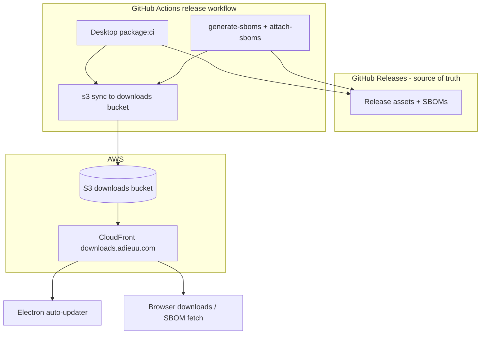

# Downloads distribution: S3 + CloudFront (`downloads.adieuu.com`)

## Goals

1. **Desktop auto-update** — Serve **electron-updater** (generic provider) over HTTPS from AWS so clients never need credentials to a **private** GitHub repo.
2. **Public download mirror** — Same distribution hosts **installers** and **update metadata** (`latest*.yml`, blockmaps, binaries) at stable URLs.
3. **SBOM visibility** — Publish release **SBOM JSON** files to the same bucket so they are **downloadable** via HTTPS (e.g. for compliance, security reviewers, or the Download page).
4. **GitHub Releases unchanged** — **Continue** uploading all release assets to **GitHub Releases** (draft → publish) as today. The S3/CloudFront path is an **additional** mirror, not a replacement; GitHub remains the operational **source of truth** for changelog, draft flow, and developer workflow.

## Why a separate bucket (not the web app bucket)

[deploy-aws-reusable.yml](../../.github/workflows/deploy-aws-reusable.yml) syncs the web build with **`--delete`**. Any object in the web bucket that is not part of `apps/web/dist` would be removed on the next web deploy. **Desktop installers, SBOMs, and update metadata must live in a dedicated bucket.**

## DNS and hostname

- **Canonical hostname:** `downloads.adieuu.com` (parameterise in Terraform as e.g. `downloads_domain_name` or derive `downloads.${apex}` from the existing public zone).
- **Hosted zone:** Use the **existing** public Route53 zone already referenced in [dns.tf](../../infra/aws/terraform/dns.tf) (`data.aws_route53_zone.public`) — add **`A` (and `AAAA` if IPv6 enabled) alias** record(s) pointing to the **new** CloudFront distribution, same pattern as [`aws_route53_record.app_alias`](../../infra/aws/terraform/dns.tf).
- **TLS:** Issue **ACM certificate in `us-east-1`** for `downloads.adieuu.com` (CloudFront requirement), DNS validation via Route53 records, attach to the new distribution’s **viewer certificate** (same flow as `aws_acm_certificate.cloudfront` for the app hostname).

## Architecture

## Suggested object layout (prefixes)

Tune in implementation; example:

| Prefix | Purpose |
|--------|---------|
| `latest/` | **Current** channel for auto-update: `latest.yml`, `latest-mac.yml`, `latest-linux.yml`, blockmaps, and referenced installers (generic provider base URL = `https://downloads.adieuu.com/latest/`). |
| `vX.Y.Z/` | **Immutable** copy per release: full desktop `out/` payload + **SBOMs** for that version. |
| `vX.Y.Z/sbom/` | SBOM JSON files (e.g. `adieuu-desktop-vX.Y.Z-sbom.json`, plus api/web/mobile if desired), mirroring names attached to GitHub. |

**SBOM availability:** After SBOMs are generated and attached to the GitHub Release, a workflow step (reuse downloaded artifacts or regenerate path) **`aws s3 cp`** / **`sync`** those files into `s3://$DOWNLOADS_BUCKET/vX.Y.Z/sbom/`. **Invalidate** CloudFront for `/vX.Y.Z/sbom/*` (and any manifest path).

Optional: generate a small **`releases.json`** or **`sbom-index.json`** listing URLs for human discovery; otherwise document the URL pattern in release notes and on the in-app Download page.

## Terraform (outline)

1. **`aws_s3_bucket`** `downloads` — private; block public access; no direct public S3 URLs.
2. **`aws_cloudfront_origin_access_control`** + **S3 bucket policy** — only the downloads distribution may `s3:GetObject` (mirror [web bucket pattern](../../infra/aws/terraform/cloudfront.tf)).
3. **`aws_cloudfront_distribution`** `downloads` — dedicated distribution (do **not** reuse the SPA web distribution; avoids SPA error responses swallowing real 404s for wrong paths and keeps cache policies simple).
   - **Aliases:** `downloads.adieuu.com`.
   - **Default cache behavior:** GET/HEAD, HTTPS redirect, appropriate cache policy (immutable versioned paths can cache long; `latest/*` short TTL + invalidation on release).
   - **No** SPA-style 403/404 → `index.html` for this distribution (unless you add a minimal `index.html` object for `/` only).
4. **`aws_acm_certificate`** (provider `aws.us_east_1`) for `downloads.adieuu.com` + validation records.
5. **`aws_route53_record`** alias `downloads` → this distribution.
6. **Outputs:** `downloads_s3_bucket_name`, `downloads_cloudfront_distribution_id`, `downloads_base_url` (`https://downloads.adieuu.com`).
7. **IAM** ([iam_github_actions_deploy.tf](../../infra/aws/terraform/iam_github_actions_deploy.tf)) — Allow `s3:PutObject`/`DeleteObject`/`ListBucket` on the downloads bucket ARN and `cloudfront:CreateInvalidation` on the downloads distribution ARN (add statements; keep web bucket statements separate).

## Electron app (`apps/desktop`)

- **`build.publish`** — `provider: generic`, `url: https://downloads.adieuu.com/latest/` (or env-injected at CI build time).
- **`main.ts`** — Production `autoUpdater` uses that feed; dev keeps simulated flow.

## CI (`release.yml`) — additive steps

1. **Keep** existing jobs: **build-and-release-desktop** → upload to GitHub Release; **generate-sboms** / **attach-sboms** → SBOMs on GitHub Release; **publish-release**.
2. **Add** a job (or extend an existing one after AWS credentials available) **`sync-downloads-mirror`**:
   - Needs: `build-and-release-desktop` (for `apps/desktop/out`), **`attach-sboms`** (for SBOM files), version `vX.Y.Z`.
   - **Sync** desktop artifacts to `s3://$BUCKET/vX.Y.Z/desktop/` (or flat under `vX.Y.Z/` — match generic URL layout).
   - **Sync** `latest/` from `out/` for auto-update channel.
   - **Copy SBOM** JSONs into `s3://$BUCKET/vX.Y.Z/sbom/` (filenames aligned with GitHub assets).
   - **`aws cloudfront create-invalidation`** for paths `/latest/*`, `/vX.Y.Z/*`.

Order: can run **after** `attach-sboms` succeeds so SBOM files are known; GitHub upload order can stay independent.

## GitHub Actions variables (once Terraform exists)

Document in [github-actions-aws.md](./github-actions-aws.md), e.g.:

| Variable | Source |
|----------|--------|
| `DEPLOY_DOWNLOADS_S3_BUCKET_ADIEUU` | Terraform output `downloads_s3_bucket_name` |
| `DEPLOY_DOWNLOADS_CLOUDFRONT_DISTRIBUTION_ID_ADIEUU` | Terraform output `downloads_cloudfront_distribution_id` |
| `DESKTOP_UPDATES_BASE_URL` | `https://downloads.adieuu.com/latest/` (or output) for embedding in desktop build |

## Security notes

- **HTTPS only** via CloudFront; bucket not public.
- SBOMs and installers are **world-readable** at URLs who can guess version paths — same as public GitHub Releases; not a secret channel.
- **Integrity:** code signing, notarization, and electron-updater blockmaps as today.

## Related

- [github-actions-aws.md](./github-actions-aws.md) — OIDC deploy role and web/API variables.
- [release.yml](../../.github/workflows/release.yml) — desktop matrix, SBOM attach, publish.
