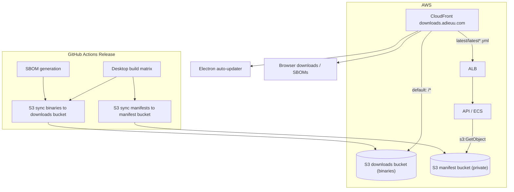

# Downloads distribution: S3 + CloudFront (`downloads.adieuu.com`)

## Goals

1. **Desktop auto-update** -- Serve **electron-updater** (generic provider) over HTTPS from AWS so clients never need credentials to a **private** GitHub repo.
2. **Public download mirror** -- Same distribution hosts **installers** and **update metadata** (blockmaps, binaries) at stable URLs.
3. **SBOM visibility** -- Publish release **SBOM JSON** files to the same bucket so they are **downloadable** via HTTPS (e.g. for compliance, security reviewers, or the Download page).
4. **`releases.json`** -- Machine-readable manifest at `https://downloads.adieuu.com/releases.json` listing all published versions, updated by CI on each release.
5. **GitHub Releases unchanged** -- **Continue** uploading all release assets to **GitHub Releases** (draft -> publish) as today. The S3/CloudFront path is an **additional** mirror, not a replacement; GitHub remains the operational **source of truth** for changelog, draft flow, and developer workflow.

## Why a separate bucket (not the web app bucket)

[deploy-aws-reusable.yml](../../.github/workflows/deploy-aws-reusable.yml) syncs the web build with **`--delete`**. Any object in the web bucket that is not part of `apps/web/dist` would be removed on the next web deploy. **Desktop installers, SBOMs, and update metadata must live in a dedicated bucket.**

## DNS and hostname

- **Canonical hostname:** `downloads.adieuu.com` (Terraform variable `downloads_domain_name`).
- **Hosted zone:** Use the **existing** public Route53 zone already referenced in [dns.tf](../../infra/aws/terraform/dns.tf) (`data.aws_route53_zone.public`) -- add **`A` alias** record pointing to the **new** CloudFront distribution, same pattern as [`aws_route53_record.app_alias`](../../infra/aws/terraform/dns.tf).
- **TLS:** Issue **ACM certificate in `us-east-1`** for `downloads.adieuu.com` (CloudFront requirement), DNS validation via Route53 records, attach to the new distribution's **viewer certificate** (same flow as `aws_acm_certificate.cloudfront` for the app hostname).

## Architecture: dual-origin CloudFront

Release manifests (`latest*.yml`) are served via the **API** (ALB origin) which reads from a **dedicated private manifest S3 bucket**. Binaries are served directly from the **downloads S3 bucket** via CloudFront OAC. This creates a trust boundary: compromising the downloads bucket alone cannot produce valid updates because the sha512 checksums in the manifest reside in a separate bucket, readable only by the API's ECS task role.

CI writes to both buckets using the existing OIDC IAM role -- no separate API authentication mechanism is needed.

electron-updater hits `https://downloads.adieuu.com/latest/latest.yml` -- CloudFront routes it to the API via the ALB origin, which reads from the private manifest bucket. The yml references binaries at the same base URL, which CloudFront serves from the downloads S3 bucket via OAC. Entirely transparent to the client.

## Object layout (prefixes)

| Prefix | Purpose |
|--------|---------|
| `latest/` | **Current** channel for auto-update: blockmaps and referenced installers (generic provider base URL = `https://downloads.adieuu.com/latest/`). **Note:** `latest.yml`, `latest-mac.yml`, `latest-linux.yml` are served via API from the private manifest bucket; they are NOT in the downloads bucket. |
| `vX.Y.Z/desktop/` | **Immutable** copy per release: full desktop `out/` payload. |
| `vX.Y.Z/sbom/` | SBOM JSON files (e.g. `adieuu-desktop-vX.Y.Z-sbom.json`, plus api/web/mobile if desired). |
| `releases.json` | Machine-readable list of all published versions with download URLs. |

## Terraform (`infra/aws/terraform/downloads.tf`)

Gated on `var.enable_downloads_stack` (requires `route53_zone_name`):

1. **`aws_s3_bucket.downloads`** -- private; block public access; no direct public S3 URLs.
2. **`aws_s3_bucket.release_manifests`** -- private; only the ECS task role may read, only the CI deploy role may write.
3. **`aws_cloudfront_origin_access_control.downloads`** + **S3 bucket policy** -- only the downloads distribution may `s3:GetObject` (mirror [web bucket pattern](../../infra/aws/terraform/cloudfront.tf)).
4. **`aws_cloudfront_distribution.downloads`** -- dedicated distribution with **two origins**:
   - **S3 origin** (default behavior): binaries via OAC.
   - **ALB origin** (ordered behavior for `latest/latest*.yml`): API reads from manifest bucket. Uses `origin_path = "/api/v1/releases"` so the CloudFront path maps to the API endpoint.
   - **No** SPA-style 403/404 -> `index.html` for this distribution.
   - **No** CloudFront access logging (privacy).
   - Custom cache policy for manifest path: short TTL (60s).
   - Managed CachingOptimized for default behavior (binaries).
5. **`aws_acm_certificate.downloads`** (provider `aws.us_east_1`) for `downloads.adieuu.com` + validation records.
6. **`aws_route53_record.downloads_alias`** -- A alias to the distribution.
7. **Outputs:** `downloads_s3_bucket_name`, `release_manifests_s3_bucket_name`, `downloads_cloudfront_distribution_id`, `downloads_base_url`.
8. **IAM** ([iam_github_actions_deploy.tf](../../infra/aws/terraform/iam_github_actions_deploy.tf)) -- CI role: `s3:PutObject`/`DeleteObject`/`ListBucket` on both the downloads bucket and manifest bucket, plus `cloudfront:CreateInvalidation` on the downloads distribution.
9. **IAM** ([iam_ecs.tf](../../infra/aws/terraform/iam_ecs.tf)) -- ECS task role: `s3:GetObject` on the manifest bucket so the API can serve manifests.

## API endpoint (`apps/api/src/routes/releases`)

- **`GET /api/v1/releases/latest/:filename`** -- reads `latest.yml`, `latest-mac.yml`, or `latest-linux.yml` from the private manifest bucket using the AWS SDK, returns `text/yaml`.
- In-memory cache (30s TTL) reduces S3 reads; CloudFront also caches at the edge (60s).
- Requires env var `RELEASE_MANIFESTS_S3_BUCKET` (injected by Terraform into the ECS task definition when `enable_downloads_stack` is true).

## Electron app (`apps/desktop`)

- **`build.publish`** -- `provider: generic`, `url: https://downloads.adieuu.com/latest/`.
- **`main.ts`** -- Production `autoUpdater` uses that feed; dev keeps simulated flow.
- **Privacy controls:**
  - User-Agent set to generic `Adieuu-Desktop-Updater` (no OS/arch/Electron details).
  - Update check interval configurable (minimum 60 minutes, default 60 minutes).
  - Automatic update checks can be disabled entirely (manual "check now" button remains).
  - Preferences stored in `update-preferences.json` in userData.
  - IPC channels: `get-update-preferences`, `set-update-preferences`, `check-for-updates`.

## CI (`release.yml`) -- additive steps

1. **Keep** existing jobs: **build-and-release-desktop** -> upload to GitHub Release; **generate-sboms** / **attach-sboms** -> SBOMs on GitHub Release; **publish-release**.
2. **Modified** `build-and-release-desktop`: each matrix runner also uploads `apps/desktop/out/` as a **workflow artifact** (via `actions/upload-artifact`) for the mirror job.
3. **New job `sync-downloads-mirror`**:
   - Needs: `release`, `build-and-release-desktop`, `attach-sboms`.
   - Skips gracefully when downloads stack variables are not configured.
   - Downloads all desktop artifacts + SBOM artifacts.
   - Syncs binaries (excluding `latest*.yml`) to `s3://$DOWNLOADS_BUCKET/latest/` and `s3://$DOWNLOADS_BUCKET/vX.Y.Z/desktop/`.
   - Copies manifest yml files to `s3://$MANIFESTS_BUCKET/`.
   - Syncs SBOMs to `s3://$DOWNLOADS_BUCKET/vX.Y.Z/sbom/`.
   - Generates/updates `releases.json` and uploads to the downloads bucket.
   - Creates CloudFront invalidation for `/latest/*`, `/vX.Y.Z/*`, `/releases.json`.
   - Uses OIDC credentials (same role writes to both buckets).

## GitHub Actions variables (once Terraform is applied)

See [github-actions-aws.md](./github-actions-aws.md) for the full list. Downloads-specific:

| Variable | Terraform output |
|----------|------------------|
| `DEPLOY_DOWNLOADS_S3_BUCKET_ADIEUU` | `downloads_s3_bucket_name` |
| `DEPLOY_RELEASE_MANIFESTS_S3_BUCKET_ADIEUU` | `release_manifests_s3_bucket_name` |
| `DEPLOY_DOWNLOADS_CLOUDFRONT_DISTRIBUTION_ID_ADIEUU` | `downloads_cloudfront_distribution_id` |

## Security notes

| Threat | Mitigation |
|--------|-----------|
| Downloads bucket compromise (binary swap) | Manifests in separate private bucket; sha512 mismatch rejects tampered binary |
| Both buckets compromised | Code signing (follow-up) provides the ultimate trust anchor |
| Man-in-the-middle | HTTPS-only via CloudFront, TLS 1.2+ minimum |
| User tracking via update checks | No CF access logging, configurable/opt-out checks, minimal User-Agent |
| CI OIDC role compromise | Requires pushing to `main` (repo access); not a static credential |
| Downloads bucket enumeration | S3 not publicly accessible; OAC-only read via CloudFront |
| Manifest bucket enumeration | Fully private; only ECS task role (read) and CI deploy role (write) |

## Privacy

- **CloudFront access logging** is explicitly disabled on the downloads distribution.
- **Update checks** expose: client IP at CloudFront edge, generic User-Agent header, request path. No account ID, user ID, or machine fingerprint is transmitted.
- **Update interval** defaults to 60 minutes (minimum 60), configurable by the user.
- **Opt-out**: users can disable automatic checks entirely; a manual "Check for updates" button remains available.

## Follow-up: code signing

Code signing and notarisation are not yet configured. The dual-origin manifest approach mitigates the worst scenario (downloads-bucket-only compromise), but code signing remains the proper long-term trust anchor:
- macOS: hardened runtime + notarisation (Apple Developer account, CI secrets)
- Windows: Authenticode signing (certificate, CI secrets)
- electron-updater: `verifyUpdateCodeSignature` + `publisherName` in config

## Related

- [github-actions-aws.md](./github-actions-aws.md) -- OIDC deploy role and web/API variables.
- [release.yml](../../.github/workflows/release.yml) -- desktop matrix, SBOM attach, publish, S3 mirror sync.
- [downloads.tf](../../infra/aws/terraform/downloads.tf) -- Terraform resources for the downloads stack.
